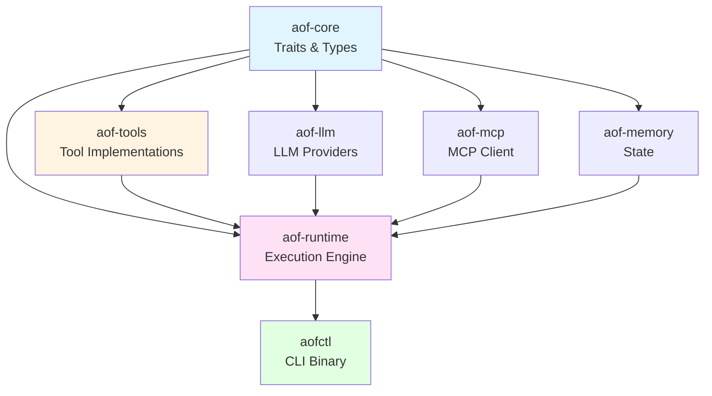

# AOF Integration Architecture Analysis - Executive Summary

**Date:** 2025-12-25
**Analyst:** Architect Agent (AOF Hive Mind)
**Objective:** Analyze AOF codebase architecture for adding New Relic, Splunk, and ServiceNow integrations
**Status:** ✅ Analysis Complete

---

## Quick Navigation

1. **[INTEGRATION_ARCHITECTURE.md](./INTEGRATION_ARCHITECTURE.md)** - Complete architectural analysis (11 sections, 600+ lines)
2. **[INTEGRATION_DIAGRAMS.md](./INTEGRATION_DIAGRAMS.md)** - Visual diagrams (14 Mermaid diagrams)
3. **[INTEGRATION_API_SPEC.md](./INTEGRATION_API_SPEC.md)** - API specifications (15+ tools, detailed specs)

---

## Executive Summary

### Architecture Overview

AOF uses a **trait-based, modular architecture** that makes adding platform integrations straightforward:

```
aof-core (traits) → aof-tools (implementations) → aof-runtime (execution) → aofctl (CLI)
```

**Key Finding:** The existing Datadog integration in `/Users/gshah/work/opsflow-sh/aof/crates/aof-tools/src/tools/datadog.rs` serves as a **perfect reference implementation** for HTTP-based API integrations.

### Recommended Approach

**Add integrations as built-in tools in the `aof-tools` crate, not as MCP servers.**

**Rationale:**
- ✅ Better performance (direct HTTP vs MCP protocol overhead)
- ✅ Type-safe (Rust compile-time validation)
- ✅ Ships with `aofctl` binary (no external dependencies)
- ✅ Consistent with existing observability tools (Datadog, Grafana, Prometheus)

---

## Implementation Roadmap

### Phase 1: New Relic (Observability) - Est. 2-3 days

**Create:** `/Users/gshah/work/opsflow-sh/aof/crates/aof-tools/src/tools/newrelic.rs`

**Tools to implement (5):**
1. `newrelic_nrql_query` - Execute NRQL queries
2. `newrelic_alert_list` - List alert violations
3. `newrelic_entity_search` - Search APM entities
4. `newrelic_metric_data` - Get metric timeseries
5. `newrelic_incident_create` - Create incidents

**Feature flag:** `observability` (already exists, extend it)

**Authentication:** `X-Api-Key` header with User API Key

**Example YAML:**
```yaml
apiVersion: aof.dev/v1
kind: Agent
metadata:
  name: newrelic-rca-agent
spec:
  model: google:gemini-2.5-flash
  tools:
    - name: newrelic_nrql_query
      config:
        account_id: "123456"
        region: "us"
```

### Phase 2: Splunk (SIEM/Logs) - Est. 3-4 days

**Create:** `/Users/gshah/work/opsflow-sh/aof/crates/aof-tools/src/tools/splunk.rs`

**Tools to implement (5):**
1. `splunk_search` - Execute SPL searches (async pattern)
2. `splunk_saved_search_run` - Run saved searches
3. `splunk_alert_list` - List triggered alerts
4. `splunk_event_submit` - Submit events to HEC
5. `splunk_index_list` - List available indexes

**Feature flag:** `siem` (NEW, add to Cargo.toml)

**Authentication:** Bearer token or Basic Auth

**Special consideration:** Splunk search is **asynchronous** - requires polling pattern (create job → poll status → get results)

**Example YAML:**
```yaml
apiVersion: aof.dev/v1
kind: Agent
metadata:
  name: splunk-log-analyzer
spec:
  model: google:gemini-2.0-flash
  tools:
    - name: splunk_search
      config:
        endpoint: "https://splunk.example.com:8089"
        allow_self_signed_certs: true
```

### Phase 3: ServiceNow (ITSM) - Est. 3-4 days

**Create:** `/Users/gshah/work/opsflow-sh/aof/crates/aof-tools/src/tools/servicenow.rs`

**Tools to implement (6):**
1. `servicenow_incident_create` - Create incident tickets
2. `servicenow_incident_update` - Update incidents
3. `servicenow_incident_query` - Query incidents
4. `servicenow_cmdb_query` - Query CMDB CIs
5. `servicenow_change_create` - Create change requests
6. `servicenow_problem_create` - Create problem tickets

**Feature flag:** `itsm` (NEW, add to Cargo.toml)

**Authentication:** Basic Auth (base64-encoded username:password)

**Special consideration:** Encoded query syntax (`^` for AND, `^OR` for OR)

**Example YAML:**
```yaml
apiVersion: aof.dev/v1
kind: Agent
metadata:
  name: servicenow-incident-manager
spec:
  model: google:gemini-2.5-flash
  tools:
    - name: servicenow_incident_create
      config:
        instance: "dev12345"
```

### Phase 4: End-to-End Integration - Est. 1-2 days

**Create fleet example:** Automated Incident Response Pipeline

**Workflow:**
1. **Tier 1 (Data Collectors):** New Relic + Splunk agents gather metrics and logs
2. **Tier 2 (Reasoners):** Claude Sonnet 4 + Gemini Pro analyze data with weighted consensus
3. **Tier 3 (Coordinator):** Manager agent synthesizes RCA and creates ServiceNow incident

**Example fleet YAML:**
```yaml
apiVersion: aof.dev/v1
kind: AgentFleet
metadata:
  name: incident-response-pipeline
spec:
  agents:
    # Tier 1: Data collectors
    - name: newrelic-collector
      tier: 1
      spec:
        model: google:gemini-2.0-flash
        tools: [newrelic_nrql_query, newrelic_metric_data]

    - name: splunk-collector
      tier: 1
      spec:
        model: google:gemini-2.0-flash
        tools: [splunk_search]

    # Tier 2: Reasoners
    - name: claude-analyzer
      tier: 2
      weight: 2.0
      spec:
        model: anthropic:claude-sonnet-4
        instructions: "Analyze observability data to find root cause"

    - name: gemini-analyzer
      tier: 2
      weight: 1.0
      spec:
        model: google:gemini-2.5-pro

    # Tier 3: Incident creator
    - name: incident-coordinator
      tier: 3
      role: manager
      spec:
        model: google:gemini-2.5-flash
        tools: [servicenow_incident_create]

  coordination:
    mode: tiered
    tiered:
      pass_all_results: true
      final_aggregation: manager_synthesis
```

---

## Key Architectural Patterns

### 1. Tool Trait Implementation

**Every tool implements:**
```rust
#[async_trait]
pub trait Tool: Send + Sync {
    async fn execute(&self, input: ToolInput) -> AofResult<ToolResult>;
    fn config(&self) -> &ToolConfig;
}
```

**Pattern from Datadog:**
```rust
pub struct DatadogMetricQueryTool {
    config: ToolConfig,
}

impl DatadogMetricQueryTool {
    pub fn new() -> Self {
        let parameters = create_schema(
            serde_json::json!({
                "api_key": { "type": "string", "description": "..." },
                "query": { "type": "string", "description": "..." },
                // ... more params
            }),
            vec!["api_key", "query"], // required fields
        );

        Self {
            config: tool_config_with_timeout(
                "datadog_metric_query",
                "Query Datadog metrics using Datadog query language",
                parameters,
                60, // timeout
            ),
        }
    }
}

#[async_trait]
impl Tool for DatadogMetricQueryTool {
    async fn execute(&self, input: ToolInput) -> AofResult<ToolResult> {
        // 1. Extract arguments
        let api_key: String = input.get_arg("api_key")?;
        let query: String = input.get_arg("query")?;

        // 2. Create authenticated client
        let client = create_client_with_auth(&api_key).await?;

        // 3. Execute HTTP request
        let response = client.get(&url).query(&params).send().await?;

        // 4. Handle response
        handle_response(response, "operation name").await
    }

    fn config(&self) -> &ToolConfig {
        &self.config
    }
}
```

### 2. Module Organization

```
aof-tools/
├── Cargo.toml
│   └── [features]
│       ├── observability = ["reqwest", "chrono"]
│       ├── siem = ["reqwest", "chrono"]  # NEW
│       └── itsm = ["reqwest", "chrono", "base64"]  # NEW
│
└── src/
    ├── lib.rs (exports)
    ├── registry.rs (ToolRegistry, BuiltinToolExecutor)
    └── tools/
        ├── mod.rs (module declarations)
        ├── common.rs (helpers: create_schema, execute_command)
        ├── datadog.rs (REFERENCE IMPLEMENTATION)
        ├── newrelic.rs (NEW)
        ├── splunk.rs (NEW)
        └── servicenow.rs (NEW)
```

### 3. Helper Functions

**Every integration should provide:**

```rust
// 1. Client creation with authentication
async fn create_{platform}_client(credentials) -> AofResult<Client> {
    let mut headers = HeaderMap::new();
    headers.insert("Authorization", ...);
    Client::builder().default_headers(headers).build()
}

// 2. Response handling
async fn handle_{platform}_response(
    response: Response,
    operation: &str,
) -> AofResult<ToolResult> {
    match response.status().as_u16() {
        200 => Ok(ToolResult::success(body)),
        401 => Ok(ToolResult::error("Authentication failed")),
        // ... more error codes
    }
}

// 3. Tool collection (for bulk registration)
pub struct {Platform}Tools;

impl {Platform}Tools {
    pub fn all() -> Vec<Box<dyn Tool>> {
        vec![
            Box::new(Tool1::new()),
            Box::new(Tool2::new()),
            // ... more tools
        ]
    }
}
```

---

## Architecture Decision Records (ADRs)

### ADR-001: Built-in Tools vs MCP Servers
**Decision:** Implement as built-in tools in `aof-tools` crate.
**Rationale:** Better performance, type safety, no external process management.

### ADR-002: Feature Flag Organization
**Decision:** Use category-based flags (`observability`, `siem`, `itsm`).
**Rationale:** Logical grouping, shared dependencies, smaller binary size.

### ADR-003: Authentication Pattern
**Decision:** Pass credentials as tool arguments, not environment variables.
**Rationale:** Multi-tenancy support, explicit configuration, flexible credential sources.

### ADR-004: Async Search Pattern (Splunk)
**Decision:** Implement polling helper for async searches.
**Rationale:** Splunk API is inherently async; hide complexity from LLM/user.

---

## Files to Modify

### Core Implementation
- ✅ `/Users/gshah/work/opsflow-sh/aof/crates/aof-tools/Cargo.toml` - Add `siem` and `itsm` feature flags
- ✅ `/Users/gshah/work/opsflow-sh/aof/crates/aof-tools/src/lib.rs` - Export new tool modules
- ✅ `/Users/gshah/work/opsflow-sh/aof/crates/aof-tools/src/tools/mod.rs` - Declare new modules
- 🆕 `/Users/gshah/work/opsflow-sh/aof/crates/aof-tools/src/tools/newrelic.rs`
- 🆕 `/Users/gshah/work/opsflow-sh/aof/crates/aof-tools/src/tools/splunk.rs`
- 🆕 `/Users/gshah/work/opsflow-sh/aof/crates/aof-tools/src/tools/servicenow.rs`

### Examples
- 🆕 `/Users/gshah/work/opsflow-sh/aof/examples/observability/newrelic-agent.yaml`
- 🆕 `/Users/gshah/work/opsflow-sh/aof/examples/observability/splunk-investigation.yaml`
- 🆕 `/Users/gshah/work/opsflow-sh/aof/examples/itsm/servicenow-automation.yaml`
- 🆕 `/Users/gshah/work/opsflow-sh/aof/examples/fleets/incident-response-pipeline.yaml`

### Documentation
- 🆕 `/Users/gshah/work/opsflow-sh/aof/docs/tools/newrelic.md`
- 🆕 `/Users/gshah/work/opsflow-sh/aof/docs/tools/splunk.md`
- 🆕 `/Users/gshah/work/opsflow-sh/aof/docs/tools/servicenow.md`
- ✅ `/Users/gshah/work/opsflow-sh/aof/docs/getting-started.md` - Add integration examples
- ✅ `/Users/gshah/work/opsflow-sh/aof/docs/DOCUMENTATION_INDEX.md` - Update index

---

## Testing Strategy

### Unit Tests (Per Tool)
```rust
#[tokio::test]
async fn test_{tool}_success() {
    let server = mockito::Server::new();
    let mock = server.mock("POST", "/api/endpoint")
        .with_status(200)
        .with_body(r#"{"results": []}"#)
        .create();

    let tool = {Tool}::new();
    let input = ToolInput::new(serde_json::json!({
        "endpoint": server.url(),
        "api_key": "test-key",
        // ... more args
    }));

    let result = tool.execute(input).await.unwrap();
    assert!(result.success);
    mock.assert();
}
```

### Integration Tests (Optional, with real APIs)
```rust
#[tokio::test]
#[ignore]  // Skip in CI, run manually
async fn test_{tool}_real_api() {
    let api_key = std::env::var("{PLATFORM}_API_KEY")
        .expect("Set {PLATFORM}_API_KEY for integration tests");
    // ... test with real API
}
```

### Fleet Tests
- Create fixture YAML files in `tests/fixtures/`
- Use `AgentFleet::from_file()` to load configurations
- Validate fleet orchestration logic

---

## Security Best Practices

### ✅ DO
- Accept credentials as tool arguments (from Context)
- Validate HTTPS endpoints (reject HTTP unless opt-in)
- Sanitize error messages (remove sensitive data)
- Use `reqwest` with default TLS validation
- Document credential sources (env vars, secrets managers)

### ❌ DON'T
- Log credentials (API keys, passwords, tokens)
- Store credentials in code or example files
- Return credentials in error messages
- Allow HTTP by default
- Accept self-signed certs without explicit opt-in

### Example Secure Configuration
```yaml
spec:
  tools:
    - name: newrelic_nrql_query
      config:
        # ✅ Credentials from context (can integrate with Vault, AWS Secrets Manager)
        api_key: "{{ secrets.newrelic_api_key }}"
        account_id: "123456"  # Not sensitive
        region: "us"

    - name: splunk_search
      config:
        endpoint: "https://splunk.example.com:8089"  # ✅ HTTPS
        allow_self_signed_certs: true  # ✅ Explicit opt-in
        auth_token: "{{ secrets.splunk_token }}"
```

---

## Performance Considerations

### HTTP Client Pooling
- Use single `reqwest::Client` instance per tool
- Built into `Tool` struct (created once in `new()`)
- Connection pooling handled automatically

### Timeout Configuration
- Default: 60 seconds for API calls
- Override via `tool_config_with_timeout()`
- User-configurable in YAML:
  ```yaml
  tools:
    - name: splunk_search
      timeout_secs: 120  # Override for long searches
  ```

### Async Polling (Splunk)
- Exponential backoff: Start 1s, max 5s
- Max attempts: 60 (5 minutes total)
- Cancellable via tokio task cancellation

---

## Documentation Deliverables

### Tool Reference Docs
Each tool module (`newrelic.rs`, `splunk.rs`, `servicenow.rs`) includes:
- Module-level documentation (Rust doc comments)
- Available tools list
- Authentication setup
- Example YAML configurations

### User Documentation (`docs/tools/`)
- `newrelic.md` - New Relic integration guide
- `splunk.md` - Splunk integration guide
- `servicenow.md` - ServiceNow integration guide

Each guide includes:
- Platform overview
- Available tools with descriptions
- Authentication setup (API key generation, permissions)
- Example agent YAML
- Common use cases (RCA, monitoring, incident automation)
- Troubleshooting (common errors, solutions)

### Tutorial Documentation
- `docs/tutorials/incident-response.md` - End-to-end RCA → ticket creation
- `docs/tutorials/multi-platform-monitoring.md` - New Relic + Splunk coordination

---

## Dependency Graph



---

## Success Metrics

### Code Quality
- ✅ All tools follow Datadog reference pattern
- ✅ 100% of tools have unit tests (mocked HTTP)
- ✅ Comprehensive error handling (401, 403, 404, 429, 5xx)
- ✅ No clippy warnings
- ✅ Helpful error messages with context

### Documentation
- ✅ Inline Rust doc comments for all public types
- ✅ User-facing docs for each platform
- ✅ Example YAML configurations
- ✅ Troubleshooting guides

### User Experience
- ✅ Consistent YAML configuration syntax
- ✅ Clear validation errors
- ✅ Credentials from Context (not hardcoded)
- ✅ Multi-platform fleet examples

---

## Next Steps for Implementation Team

### Immediate Actions
1. **Read reference implementation:** Review `/Users/gshah/work/opsflow-sh/aof/crates/aof-tools/src/tools/datadog.rs` thoroughly
2. **Set up development environment:**
   ```bash
   cd /Users/gshah/work/opsflow-sh/aof
   cargo check --features observability
   cargo test --lib --features observability
   ```
3. **Create feature branches:**
   - `feature/newrelic-integration`
   - `feature/splunk-integration`
   - `feature/servicenow-integration`

### Phase-by-Phase Approach
1. **Start with New Relic** (simplest, HTTP-based, similar to Datadog)
2. **Then Splunk** (introduces async polling pattern)
3. **Finally ServiceNow** (ITSM-specific patterns like encoded queries)
4. **End-to-end integration** (fleet example combining all three)

### Development Workflow
1. Create tool struct with `config: ToolConfig`
2. Implement `Tool` trait (`execute()`, `config()`)
3. Add helper functions (client creation, response handling)
4. Write unit tests with `mockito`
5. Update `mod.rs` and `lib.rs` exports
6. Create example YAML
7. Write user documentation
8. Test end-to-end with `aofctl`

---

## Resources

### Documentation Files
- **[INTEGRATION_ARCHITECTURE.md](./INTEGRATION_ARCHITECTURE.md)** - Complete architectural analysis
- **[INTEGRATION_DIAGRAMS.md](./INTEGRATION_DIAGRAMS.md)** - Visual diagrams
- **[INTEGRATION_API_SPEC.md](./INTEGRATION_API_SPEC.md)** - API specifications

### Code References
- **Datadog implementation:** `/Users/gshah/work/opsflow-sh/aof/crates/aof-tools/src/tools/datadog.rs`
- **Grafana implementation:** `/Users/gshah/work/opsflow-sh/aof/crates/aof-tools/src/tools/grafana.rs`
- **Observability tools:** `/Users/gshah/work/opsflow-sh/aof/crates/aof-tools/src/tools/observability.rs`
- **Tool registry:** `/Users/gshah/work/opsflow-sh/aof/crates/aof-tools/src/registry.rs`

### External API Documentation
- **New Relic API:** https://docs.newrelic.com/docs/apis/rest-api-v2/
- **Splunk REST API:** https://docs.splunk.com/Documentation/Splunk/latest/RESTREF/RESTprolog
- **ServiceNow Table API:** https://docs.servicenow.com/bundle/tokyo-application-development/page/integrate/inbound-rest/concept/c_TableAPI.html

---

## Conclusion

**AOF's architecture is well-designed for platform integration extensibility.**

The trait-based abstraction pattern, combined with the existing Datadog reference implementation, provides a clear blueprint for adding New Relic, Splunk, and ServiceNow integrations.

**Estimated total implementation time:** 8-12 days for all three platforms plus end-to-end integration.

**Architecture is ready. Implementation can begin immediately.**

---

**Analysis completed by:** Architect Agent (AOF Hive Mind)
**Analysis date:** 2025-12-25
**Status:** ✅ Complete and ready for implementation
