# AOF Integration Architecture - Visual Diagrams

## 1. Crate Dependency Graph

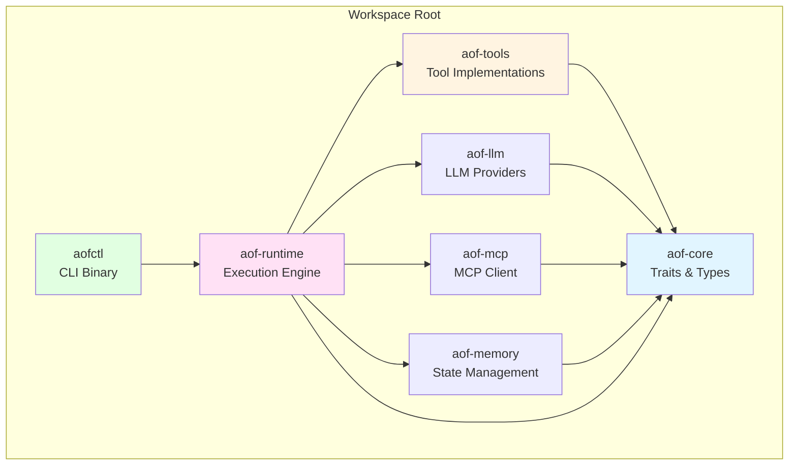

## 2. Tool Implementation Layer

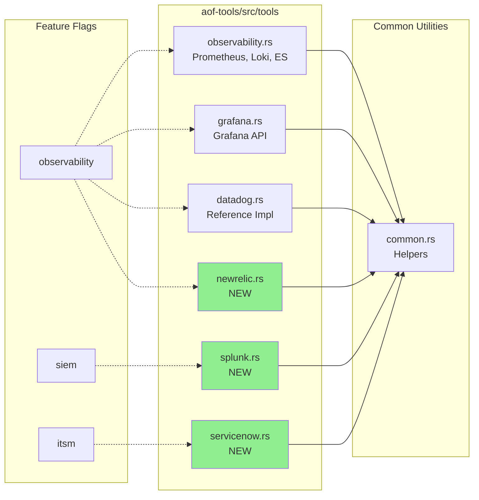

## 3. Tool Trait Implementation Flow

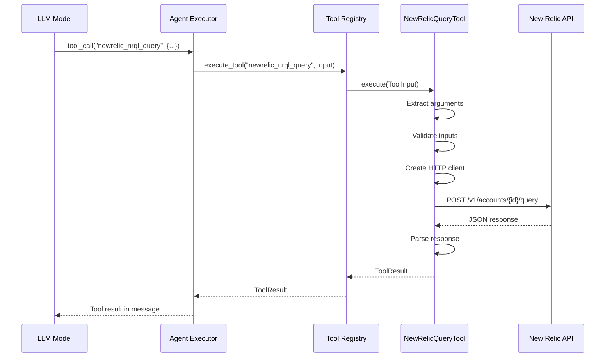

## 4. Integration Architecture Layers

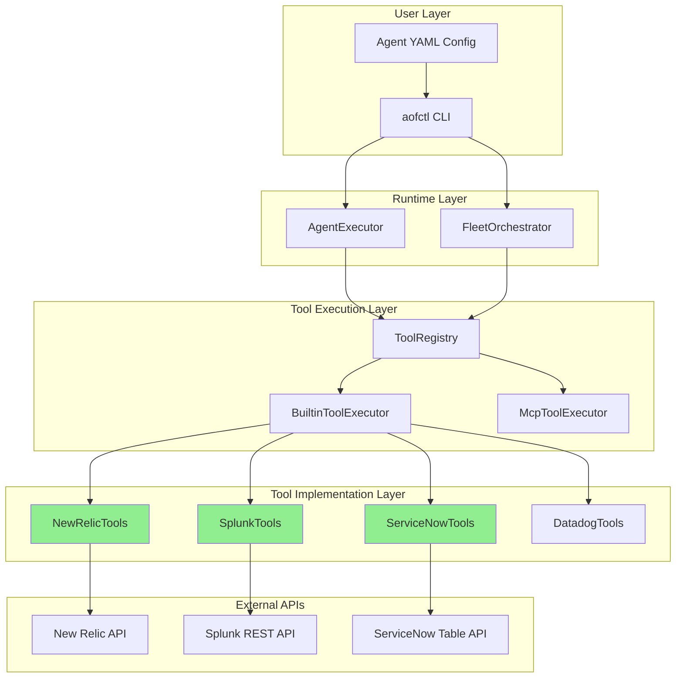

## 5. Tiered Fleet Execution (RCA Example)

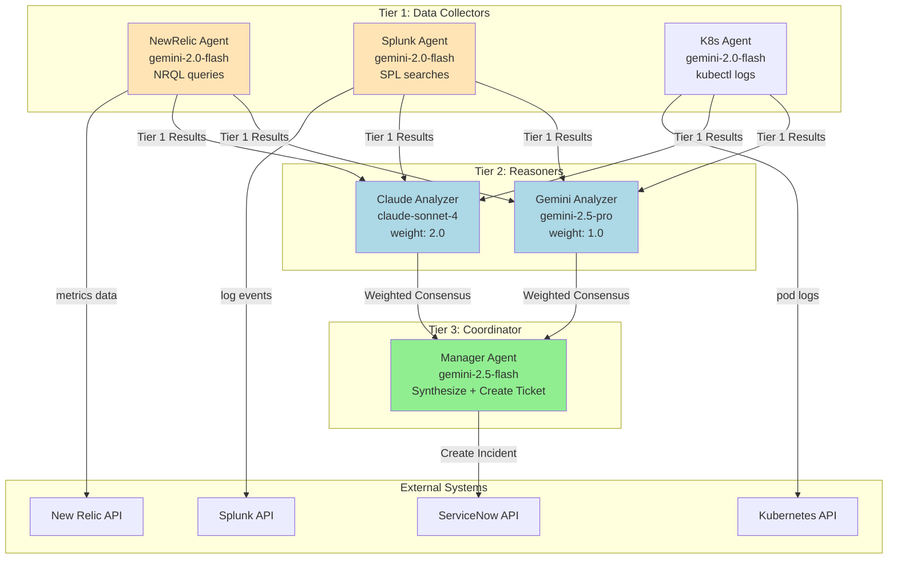

## 6. Tool Registration Flow

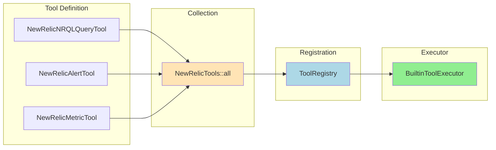

## 7. Authentication Flow

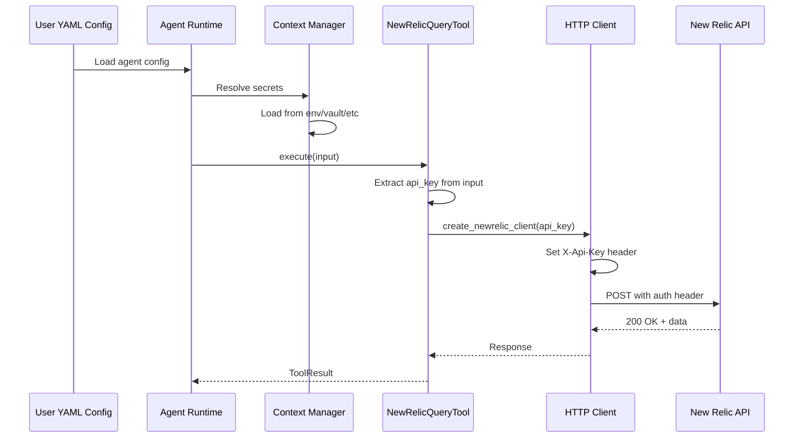

## 8. Splunk Async Search Pattern

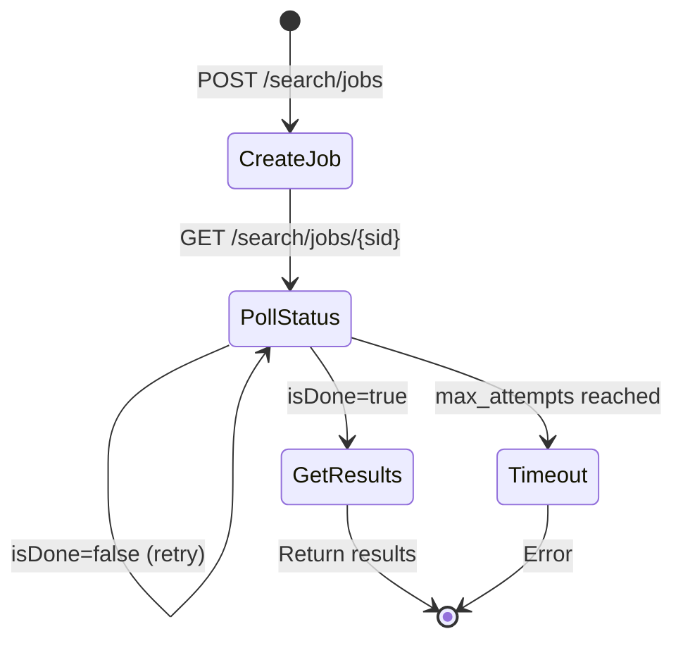

## 9. Data Flow: Incident Response Pipeline

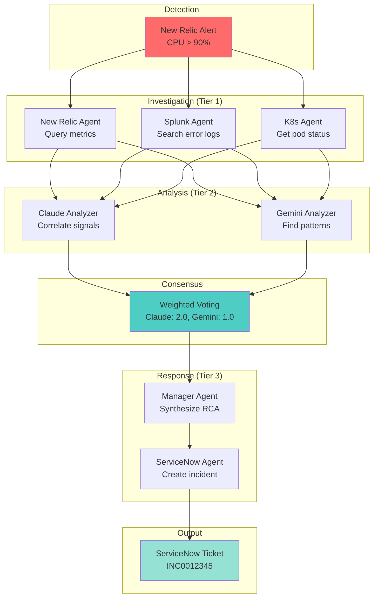

## 10. Tool Configuration Schema

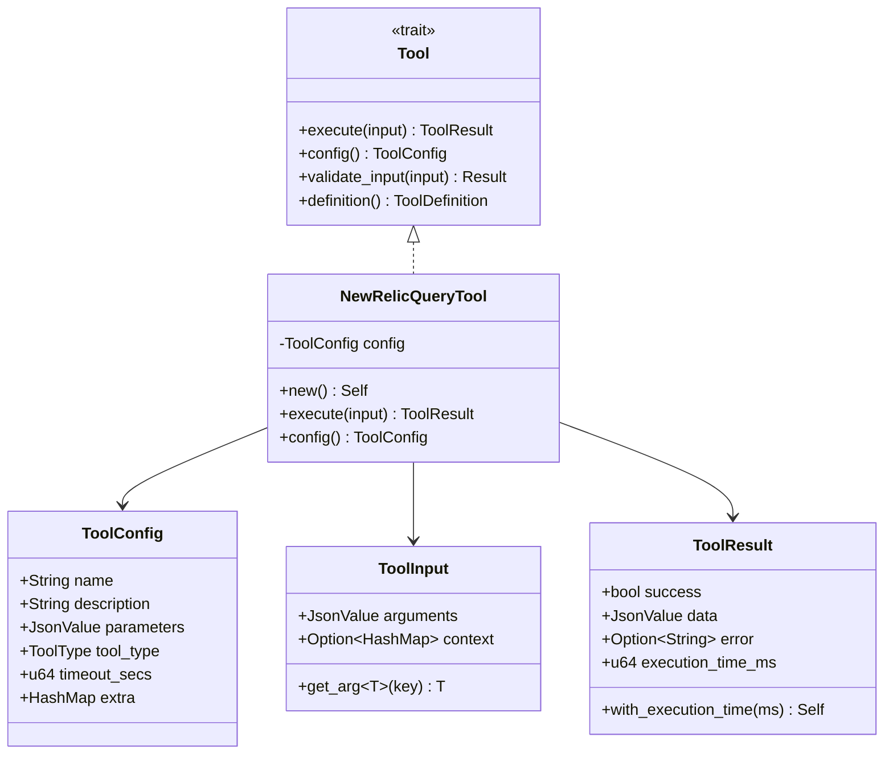

## 11. Feature Flag Dependencies

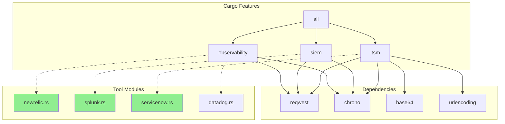

## 12. Error Handling Flow

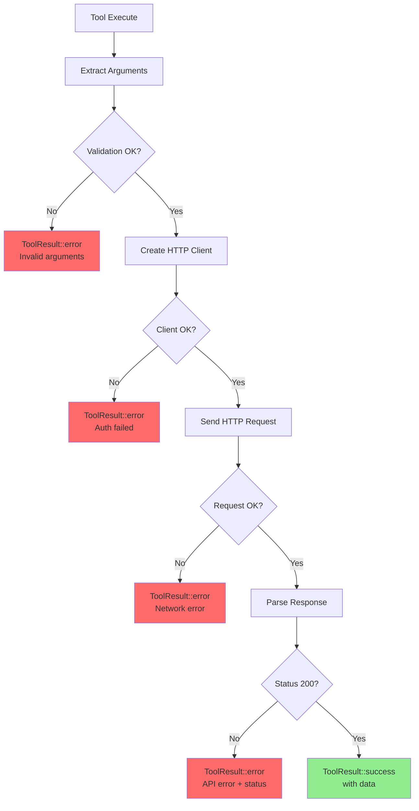

## 13. Module Organization

```
aof-tools/
├── Cargo.toml
│   └── [features]
│       ├── observability = ["reqwest", "chrono"]
│       ├── siem = ["reqwest", "chrono"]
│       └── itsm = ["reqwest", "chrono", "base64"]
│
├── src/
│   ├── lib.rs
│   │   └── pub use tools::{NewRelicTools, SplunkTools, ServiceNowTools}
│   │
│   ├── registry.rs
│   │   ├── ToolRegistry
│   │   ├── BuiltinToolExecutor
│   │   └── CompositeToolExecutor
│   │
│   └── tools/
│       ├── mod.rs
│       │   ├── #[cfg(feature = "observability")]
│       │   ├── #[cfg(feature = "siem")]
│       │   └── #[cfg(feature = "itsm")]
│       │
│       ├── common.rs
│       │   ├── create_schema()
│       │   ├── tool_config()
│       │   └── execute_command()
│       │
│       ├── observability.rs
│       ├── datadog.rs (REFERENCE)
│       ├── newrelic.rs (NEW)
│       ├── splunk.rs (NEW)
│       └── servicenow.rs (NEW)
│
└── tests/
    ├── newrelic_tests.rs
    ├── splunk_tests.rs
    └── servicenow_tests.rs
```

## 14. Deployment Architecture

```mermaid
graph TB
    subgraph "Development"
        Dev[Developer]
        Code[Write Tool Code]
        Test[Unit Tests]
    end

    subgraph "Build"
        Cargo[cargo build --release]
        Features[--features observability,siem,itsm]
    end

    subgraph "Binary"
        Binary[aofctl]
        Tools[Built-in Tools<br/>NewRelic, Splunk, ServiceNow]
    end

    subgraph "Runtime"
        Agent[Agent Runtime]
        Registry[Tool Registry]
    end

    subgraph "External APIs"
        NR[New Relic]
        SP[Splunk]
        SN[ServiceNow]
    end

    Dev --> Code
    Code --> Test
    Test --> Cargo
    Cargo --> Features
    Features --> Binary
    Binary --> Tools
    Tools --> Agent
    Agent --> Registry
    Registry --> NR
    Registry --> SP
    Registry --> SN

    style Binary fill:#90EE90
    style Tools fill:#FFE4B5
```

---

## Diagram Usage Guide

- **Diagram 1-2:** Understand overall crate structure and module organization
- **Diagram 3:** Learn how tools are invoked at runtime
- **Diagram 4:** See the full stack from YAML to API calls
- **Diagram 5:** Understand multi-tier fleet execution pattern
- **Diagram 6-7:** Tool registration and authentication flows
- **Diagram 8:** Splunk's unique async search pattern
- **Diagram 9:** Complete incident response data flow
- **Diagram 10:** Core data structures and relationships
- **Diagram 11:** Feature flag dependencies for compilation
- **Diagram 12:** Error handling patterns to implement
- **Diagram 13:** File organization reference
- **Diagram 14:** Build and deployment architecture

**These diagrams complement the written architecture analysis in `INTEGRATION_ARCHITECTURE.md`.**
