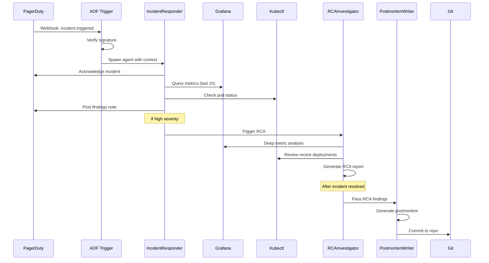

# Phase 2: Observability & Incident Management - Internal Design Document

**Version**: 0.3.0
**Target Release**: Q1 2025
**Status**: Architecture Design
**Author**: Hive Mind Swarm (ARCHITECT agent)
**Date**: 2025-12-23

---

## Table of Contents

1. [Overview](#1-overview)
2. [New Trigger Platforms](#2-new-trigger-platforms)
3. [New Tools](#3-new-tools)
4. [Pre-built Agents](#4-pre-built-agents)
5. [Integration Patterns](#5-integration-patterns)
6. [Testing Strategy](#6-testing-strategy)
7. [Migration Guide](#7-migration-guide)
8. [Implementation Roadmap](#8-implementation-roadmap)

---

## 1. Overview

### 1.1 Phase 2 Goals

Phase 2 completes the **incident lifecycle** by adding:
- **Incident detection** via PagerDuty and Opsgenie webhooks
- **Metric/log querying** via Grafana and Datadog APIs
- **Automated incident response** via 4 pre-built intelligent agents

This transforms AOF from a general automation framework into a **complete incident management platform**.

### 1.2 Scope

**In Scope (v0.3.0)**:
- ✅ PagerDuty trigger (P0)
- ✅ Opsgenie trigger (P1)
- ✅ Grafana tool (P0)
- ✅ Datadog tool (P1)
- ✅ 4 pre-built agents (incident-responder, alert-analyzer, rca-investigator, postmortem-writer)
- ✅ Integration patterns and examples
- ✅ Documentation and tutorials

**Out of Scope (Future Phases)**:
- ❌ ServiceNow trigger (P2 - v0.3.1)
- ❌ Loki tool (P1 - already exists in observability.rs)
- ❌ Jaeger tool (P2 - v0.4.0)
- ❌ Advanced ML-based anomaly detection

### 1.3 Success Metrics

- **Adoption**: 50+ GitHub stars increase
- **Quality**: 80%+ test coverage on new code
- **Performance**: <2s webhook-to-agent latency
- **Documentation**: 100% feature coverage with examples

---

## 2. New Trigger Platforms

### 2.1 Architecture Pattern

Both PagerDuty and Opsgenie follow the established **TriggerPlatform trait** pattern:

```rust
// crates/aof-triggers/src/platforms/mod.rs
pub mod pagerduty;  // NEW
pub mod opsgenie;   // NEW

// Registry update
impl PlatformRegistry {
    pub fn register_defaults(&mut self) {
        // ... existing platforms ...

        // PagerDuty
        self.register("pagerduty", Box::new(|config| {
            let cfg: PagerDutyConfig = serde_json::from_value(config)?;
            Ok(Box::new(PagerDutyPlatform::new(cfg)?))
        }));

        // Opsgenie
        self.register("opsgenie", Box::new(|config| {
            let cfg: OpsgenieConfig = serde_json::from_value(config)?;
            Ok(Box::new(OpsgeniePlatform::new(cfg)?))
        }));
    }
}
```

### 2.2 PagerDuty Integration

#### 2.2.1 Configuration Structure

```rust
// crates/aof-triggers/src/platforms/pagerduty.rs

/// PagerDuty platform configuration
#[derive(Debug, Clone, Serialize, Deserialize)]
pub struct PagerDutyConfig {
    /// API token for making API calls (v2 REST API)
    pub api_token: String,

    /// Webhook signing secret (for v3 webhooks)
    pub webhook_secret: String,

    /// Bot name for identification
    #[serde(default = "default_bot_name")]
    pub bot_name: String,

    /// Allowed service IDs (optional filter)
    #[serde(default)]
    pub allowed_services: Option<Vec<String>>,

    /// Allowed event types (optional filter)
    /// Default: ["incident.triggered", "incident.acknowledged", "incident.resolved"]
    #[serde(default)]
    pub allowed_events: Option<Vec<String>>,

    /// Auto-acknowledge incidents matching patterns
    #[serde(default)]
    pub auto_ack_patterns: Option<Vec<String>>,

    /// Enable posting incident notes
    #[serde(default = "default_true")]
    pub enable_notes: bool,
}

fn default_bot_name() -> String {
    "aofbot".to_string()
}

fn default_true() -> bool {
    true
}
```

#### 2.2.2 Webhook Event Types

PagerDuty supports these webhook event types:

| Event Type | Description | Priority |
|------------|-------------|----------|
| `incident.triggered` | New incident created | P0 |
| `incident.acknowledged` | Someone acknowledged | P0 |
| `incident.resolved` | Incident resolved | P0 |
| `incident.escalated` | Escalated to next level | P1 |
| `incident.reassigned` | Reassigned to different user | P1 |
| `incident.annotated` | Note added | P2 |
| `incident.priority_updated` | Priority changed | P1 |

#### 2.2.3 Webhook Payload Structure

```rust
/// PagerDuty webhook payload
#[derive(Debug, Clone, Deserialize)]
pub struct PagerDutyWebhookPayload {
    /// Event type (e.g., "incident.triggered")
    pub event: String,

    /// Log entries describing the event
    pub log_entries: Vec<LogEntry>,

    /// Incident details
    pub incident: Incident,
}

/// PagerDuty incident
#[derive(Debug, Clone, Deserialize)]
pub struct Incident {
    pub id: String,
    pub incident_number: u64,
    pub title: String,
    pub description: Option<String>,
    pub status: String, // "triggered", "acknowledged", "resolved"
    pub urgency: String, // "high", "low"
    pub priority: Option<Priority>,
    pub service: Service,
    pub created_at: String,
    pub updated_at: String,
    pub html_url: String,

    /// Assigned users
    #[serde(default)]
    pub assignments: Vec<Assignment>,

    /// Alert details
    #[serde(default)]
    pub alerts: Vec<Alert>,
}

/// PagerDuty service
#[derive(Debug, Clone, Deserialize)]
pub struct Service {
    pub id: String,
    pub name: String,
    pub summary: String,
}

/// Priority information
#[derive(Debug, Clone, Deserialize)]
pub struct Priority {
    pub id: String,
    pub name: String, // "P1", "P2", etc.
    pub summary: String,
}

/// User assignment
#[derive(Debug, Clone, Deserialize)]
pub struct Assignment {
    pub assignee: User,
}

/// PagerDuty user
#[derive(Debug, Clone, Deserialize)]
pub struct User {
    pub id: String,
    pub summary: String,
    pub email: Option<String>,
}

/// Alert within incident
#[derive(Debug, Clone, Deserialize)]
pub struct Alert {
    pub id: String,
    pub summary: String,
    pub severity: String, // "critical", "error", "warning", "info"
    pub created_at: String,
    pub body: Option<AlertBody>,
}

/// Alert body with custom details
#[derive(Debug, Clone, Deserialize)]
pub struct AlertBody {
    #[serde(flatten)]
    pub details: HashMap<String, serde_json::Value>,
}

/// Log entry
#[derive(Debug, Clone, Deserialize)]
pub struct LogEntry {
    pub id: String,
    pub r#type: String,
    pub summary: String,
    pub created_at: String,
    pub agent: Option<User>,
}
```

#### 2.2.4 Signature Verification

PagerDuty uses **HMAC-SHA256** signature verification (v3 webhooks):

```rust
impl PagerDutyPlatform {
    /// Verify PagerDuty webhook signature
    ///
    /// PagerDuty signs webhooks using HMAC-SHA256:
    /// - Header: X-PagerDuty-Signature
    /// - Format: v1=<hex_signature>
    /// - Signing data: <timestamp>.<webhook_body>
    fn verify_pagerduty_signature(
        &self,
        payload: &[u8],
        signature: &str,
        timestamp: &str,
    ) -> bool {
        // Signature format: v1=<hex_signature>
        if !signature.starts_with("v1=") {
            debug!("Invalid signature format - must start with v1=");
            return false;
        }

        let provided_signature = &signature[3..];

        // Signing data: timestamp.body
        let signing_data = format!("{}.{}", timestamp,
            String::from_utf8_lossy(payload));

        let mut mac = match HmacSha256::new_from_slice(
            self.config.webhook_secret.as_bytes()
        ) {
            Ok(m) => m,
            Err(e) => {
                error!("HMAC setup failed: {}", e);
                return false;
            }
        };

        mac.update(signing_data.as_bytes());
        let result = mac.finalize();
        let computed_signature = hex::encode(result.into_bytes());

        computed_signature == provided_signature
    }
}
```

#### 2.2.5 TriggerMessage Mapping

```rust
impl PagerDutyPlatform {
    /// Build TriggerMessage from PagerDuty webhook
    fn build_trigger_message(
        &self,
        event_type: &str,
        payload: &PagerDutyWebhookPayload,
    ) -> Result<TriggerMessage, PlatformError> {
        let incident = &payload.incident;

        // Build message text: "incident:<event>:<urgency>:<number> <title>"
        let text = format!(
            "incident:{}:{}:{} {} - {}",
            event_type.trim_start_matches("incident."),
            incident.urgency,
            incident.incident_number,
            incident.title,
            incident.description.as_deref().unwrap_or("")
        );

        // Channel ID: service ID
        let channel_id = incident.service.id.clone();

        // User: first assignee or "unassigned"
        let user = if let Some(assignment) = incident.assignments.first() {
            TriggerUser {
                id: assignment.assignee.id.clone(),
                username: Some(assignment.assignee.summary.clone()),
                display_name: assignment.assignee.email.clone(),
                is_bot: false,
            }
        } else {
            TriggerUser {
                id: "unassigned".to_string(),
                username: Some("unassigned".to_string()),
                display_name: None,
                is_bot: false,
            }
        };

        // Metadata with full incident details
        let mut metadata = HashMap::new();
        metadata.insert("event_type".to_string(), serde_json::json!(event_type));
        metadata.insert("incident_id".to_string(), serde_json::json!(incident.id));
        metadata.insert("incident_number".to_string(), serde_json::json!(incident.incident_number));
        metadata.insert("status".to_string(), serde_json::json!(incident.status));
        metadata.insert("urgency".to_string(), serde_json::json!(incident.urgency));
        metadata.insert("service_id".to_string(), serde_json::json!(incident.service.id));
        metadata.insert("service_name".to_string(), serde_json::json!(incident.service.name));
        metadata.insert("html_url".to_string(), serde_json::json!(incident.html_url));

        if let Some(ref priority) = incident.priority {
            metadata.insert("priority".to_string(), serde_json::json!(priority.name));
        }

        // Add alert details
        if !incident.alerts.is_empty() {
            let alert_count = incident.alerts.len();
            metadata.insert("alert_count".to_string(), serde_json::json!(alert_count));

            // Include first alert details
            if let Some(alert) = incident.alerts.first() {
                metadata.insert("alert_severity".to_string(), serde_json::json!(alert.severity));
                metadata.insert("alert_summary".to_string(), serde_json::json!(alert.summary));
            }
        }

        Ok(TriggerMessage {
            id: format!("pd-incident-{}", incident.id),
            platform: "pagerduty".to_string(),
            channel_id,
            user,
            text,
            timestamp: chrono::Utc::now(),
            metadata,
            thread_id: Some(format!("incident-{}", incident.incident_number)),
            reply_to: None,
        })
    }
}
```

#### 2.2.6 API Methods

```rust
impl PagerDutyPlatform {
    /// Post a note to an incident
    pub async fn post_note(
        &self,
        incident_id: &str,
        note: &str,
    ) -> Result<String, PlatformError> {
        if !self.config.enable_notes {
            return Err(PlatformError::ApiError("Notes are disabled".to_string()));
        }

        let url = format!("https://api.pagerduty.com/incidents/{}/notes", incident_id);

        let payload = serde_json::json!({
            "note": {
                "content": note
            }
        });

        let response = self.client
            .post(&url)
            .header("Authorization", format!("Token token={}", self.config.api_token))
            .header("Accept", "application/vnd.pagerduty+json;version=2")
            .header("Content-Type", "application/json")
            .json(&payload)
            .send()
            .await
            .map_err(|e| PlatformError::ApiError(format!("HTTP request failed: {}", e)))?;

        if !response.status().is_success() {
            return Err(PlatformError::ApiError(
                format!("PagerDuty API error: {}", response.status())
            ));
        }

        let result: serde_json::Value = response.json().await
            .map_err(|e| PlatformError::ParseError(format!("Failed to parse response: {}", e)))?;

        let note_id = result["note"]["id"].as_str()
            .ok_or_else(|| PlatformError::ParseError("Missing note ID".to_string()))?;

        Ok(note_id.to_string())
    }

    /// Acknowledge an incident
    pub async fn acknowledge_incident(
        &self,
        incident_id: &str,
        from_email: &str,
    ) -> Result<(), PlatformError> {
        let url = format!("https://api.pagerduty.com/incidents/{}", incident_id);

        let payload = serde_json::json!({
            "incident": {
                "type": "incident_reference",
                "status": "acknowledged"
            }
        });

        let response = self.client
            .put(&url)
            .header("Authorization", format!("Token token={}", self.config.api_token))
            .header("Accept", "application/vnd.pagerduty+json;version=2")
            .header("From", from_email)
            .header("Content-Type", "application/json")
            .json(&payload)
            .send()
            .await
            .map_err(|e| PlatformError::ApiError(format!("HTTP request failed: {}", e)))?;

        if !response.status().is_success() {
            return Err(PlatformError::ApiError(
                format!("Failed to acknowledge incident: {}", response.status())
            ));
        }

        Ok(())
    }

    /// Resolve an incident
    pub async fn resolve_incident(
        &self,
        incident_id: &str,
        from_email: &str,
        resolution: &str,
    ) -> Result<(), PlatformError> {
        // First post resolution note
        self.post_note(incident_id, resolution).await?;

        // Then resolve
        let url = format!("https://api.pagerduty.com/incidents/{}", incident_id);

        let payload = serde_json::json!({
            "incident": {
                "type": "incident_reference",
                "status": "resolved"
            }
        });

        let response = self.client
            .put(&url)
            .header("Authorization", format!("Token token={}", self.config.api_token))
            .header("Accept", "application/vnd.pagerduty+json;version=2")
            .header("From", from_email)
            .header("Content-Type", "application/json")
            .json(&payload)
            .send()
            .await
            .map_err(|e| PlatformError::ApiError(format!("HTTP request failed: {}", e)))?;

        if !response.status().is_success() {
            return Err(PlatformError::ApiError(
                format!("Failed to resolve incident: {}", response.status())
            ));
        }

        Ok(())
    }

    /// Update incident priority
    pub async fn update_priority(
        &self,
        incident_id: &str,
        priority_id: &str,
        from_email: &str,
    ) -> Result<(), PlatformError> {
        let url = format!("https://api.pagerduty.com/incidents/{}", incident_id);

        let payload = serde_json::json!({
            "incident": {
                "type": "incident_reference",
                "priority": {
                    "id": priority_id,
                    "type": "priority_reference"
                }
            }
        });

        let response = self.client
            .put(&url)
            .header("Authorization", format!("Token token={}", self.config.api_token))
            .header("Accept", "application/vnd.pagerduty+json;version=2")
            .header("From", from_email)
            .header("Content-Type", "application/json")
            .json(&payload)
            .send()
            .await
            .map_err(|e| PlatformError::ApiError(format!("HTTP request failed: {}", e)))?;

        if !response.status().is_success() {
            return Err(PlatformError::ApiError(
                format!("Failed to update priority: {}", response.status())
            ));
        }

        Ok(())
    }
}
```

### 2.3 Opsgenie Integration

#### 2.3.1 Configuration Structure

```rust
// crates/aof-triggers/src/platforms/opsgenie.rs

/// Opsgenie platform configuration
#[derive(Debug, Clone, Serialize, Deserialize)]
pub struct OpsgenieConfig {
    /// API key for Opsgenie API
    pub api_key: String,

    /// Webhook signing secret
    pub webhook_secret: String,

    /// API endpoint (US or EU)
    #[serde(default = "default_api_endpoint")]
    pub api_endpoint: String,

    /// Bot name for identification
    #[serde(default = "default_bot_name")]
    pub bot_name: String,

    /// Allowed team IDs (optional filter)
    #[serde(default)]
    pub allowed_teams: Option<Vec<String>>,

    /// Allowed alert tags (optional filter)
    #[serde(default)]
    pub allowed_tags: Option<Vec<String>>,

    /// Allowed event types
    #[serde(default)]
    pub allowed_events: Option<Vec<String>>,

    /// Enable posting alert notes
    #[serde(default = "default_true")]
    pub enable_notes: bool,
}

fn default_api_endpoint() -> String {
    "https://api.opsgenie.com".to_string()
}

fn default_bot_name() -> String {
    "aofbot".to_string()
}

fn default_true() -> bool {
    true
}
```

#### 2.3.2 Webhook Event Types

Opsgenie webhook event types:

| Event Type | Description | Priority |
|------------|-------------|----------|
| `Create` | New alert created | P0 |
| `Acknowledge` | Alert acknowledged | P0 |
| `Close` | Alert closed | P0 |
| `Escalate` | Alert escalated | P1 |
| `AddNote` | Note added | P1 |
| `AddTags` | Tags added | P2 |
| `AssignOwnership` | Owner assigned | P1 |

#### 2.3.3 Webhook Payload Structure

```rust
/// Opsgenie webhook payload
#[derive(Debug, Clone, Deserialize)]
pub struct OpsgenieWebhookPayload {
    /// Action type (Create, Acknowledge, Close, etc.)
    pub action: String,

    /// Alert details
    pub alert: OpsgenieAlert,

    /// Integration information
    #[serde(default)]
    pub integration: Option<Integration>,
}

/// Opsgenie alert
#[derive(Debug, Clone, Deserialize)]
pub struct OpsgenieAlert {
    #[serde(rename = "alertId")]
    pub alert_id: String,

    pub message: String,

    #[serde(default)]
    pub description: Option<String>,

    pub priority: String, // "P1", "P2", "P3", "P4", "P5"

    pub status: String, // "open", "ack", "closed"

    #[serde(default)]
    pub tags: Vec<String>,

    #[serde(default)]
    pub teams: Vec<Team>,

    #[serde(default)]
    pub owner: Option<String>,

    #[serde(rename = "createdAt")]
    pub created_at: u64, // Unix timestamp

    #[serde(rename = "updatedAt")]
    pub updated_at: u64,

    #[serde(default)]
    pub details: HashMap<String, String>,
}

/// Team information
#[derive(Debug, Clone, Deserialize)]
pub struct Team {
    pub id: String,
    pub name: String,
}

/// Integration information
#[derive(Debug, Clone, Deserialize)]
pub struct Integration {
    pub id: String,
    pub name: String,
    pub r#type: String,
}
```

#### 2.3.4 Signature Verification

Opsgenie uses **HMAC-SHA256** with a different format:

```rust
impl OpsgeniePlatform {
    /// Verify Opsgenie webhook signature
    ///
    /// Opsgenie signs webhooks using HMAC-SHA256:
    /// - Header: X-Opsgenie-Signature
    /// - Signing data: <raw_body>
    fn verify_opsgenie_signature(
        &self,
        payload: &[u8],
        signature: &str,
    ) -> bool {
        let mut mac = match HmacSha256::new_from_slice(
            self.config.webhook_secret.as_bytes()
        ) {
            Ok(m) => m,
            Err(e) => {
                error!("HMAC setup failed: {}", e);
                return false;
            }
        };

        mac.update(payload);
        let result = mac.finalize();
        let computed_signature = hex::encode(result.into_bytes());

        computed_signature == signature
    }
}
```

#### 2.3.5 API Methods

```rust
impl OpsgeniePlatform {
    /// Add note to alert
    pub async fn add_note(
        &self,
        alert_id: &str,
        note: &str,
    ) -> Result<(), PlatformError> {
        if !self.config.enable_notes {
            return Err(PlatformError::ApiError("Notes are disabled".to_string()));
        }

        let url = format!("{}/v2/alerts/{}/notes",
            self.config.api_endpoint, alert_id);

        let payload = serde_json::json!({
            "note": note
        });

        let response = self.client
            .post(&url)
            .header("Authorization", format!("GenieKey {}", self.config.api_key))
            .json(&payload)
            .send()
            .await
            .map_err(|e| PlatformError::ApiError(format!("HTTP request failed: {}", e)))?;

        if !response.status().is_success() {
            return Err(PlatformError::ApiError(
                format!("Opsgenie API error: {}", response.status())
            ));
        }

        Ok(())
    }

    /// Acknowledge alert
    pub async fn acknowledge_alert(
        &self,
        alert_id: &str,
        user: &str,
    ) -> Result<(), PlatformError> {
        let url = format!("{}/v2/alerts/{}/acknowledge",
            self.config.api_endpoint, alert_id);

        let payload = serde_json::json!({
            "user": user
        });

        let response = self.client
            .post(&url)
            .header("Authorization", format!("GenieKey {}", self.config.api_key))
            .json(&payload)
            .send()
            .await
            .map_err(|e| PlatformError::ApiError(format!("HTTP request failed: {}", e)))?;

        if !response.status().is_success() {
            return Err(PlatformError::ApiError(
                format!("Failed to acknowledge alert: {}", response.status())
            ));
        }

        Ok(())
    }

    /// Close alert
    pub async fn close_alert(
        &self,
        alert_id: &str,
        user: &str,
        note: Option<&str>,
    ) -> Result<(), PlatformError> {
        // Add note if provided
        if let Some(n) = note {
            self.add_note(alert_id, n).await?;
        }

        let url = format!("{}/v2/alerts/{}/close",
            self.config.api_endpoint, alert_id);

        let payload = serde_json::json!({
            "user": user
        });

        let response = self.client
            .post(&url)
            .header("Authorization", format!("GenieKey {}", self.config.api_key))
            .json(&payload)
            .send()
            .await
            .map_err(|e| PlatformError::ApiError(format!("HTTP request failed: {}", e)))?;

        if !response.status().is_success() {
            return Err(PlatformError::ApiError(
                format!("Failed to close alert: {}", response.status())
            ));
        }

        Ok(())
    }

    /// Add tags to alert
    pub async fn add_tags(
        &self,
        alert_id: &str,
        tags: &[String],
    ) -> Result<(), PlatformError> {
        let url = format!("{}/v2/alerts/{}/tags",
            self.config.api_endpoint, alert_id);

        let payload = serde_json::json!({
            "tags": tags
        });

        let response = self.client
            .post(&url)
            .header("Authorization", format!("GenieKey {}", self.config.api_key))
            .json(&payload)
            .send()
            .await
            .map_err(|e| PlatformError::ApiError(format!("HTTP request failed: {}", e)))?;

        if !response.status().is_success() {
            return Err(PlatformError::ApiError(
                format!("Failed to add tags: {}", response.status())
            ));
        }

        Ok(())
    }
}
```

---

## 3. New Tools

### 3.1 Grafana Tool

#### 3.1.1 Tool Structure

```rust
// crates/aof-tools/src/tools/observability.rs (extend existing file)

/// Grafana API tool
pub struct GrafanaTool {
    config: ToolConfig,
}

impl GrafanaTool {
    pub fn new() -> Self {
        let parameters = create_schema(
            serde_json::json!({
                "endpoint": {
                    "type": "string",
                    "description": "Grafana server URL (e.g., https://grafana.example.com)"
                },
                "api_key": {
                    "type": "string",
                    "description": "Grafana API key (service account token)"
                },
                "operation": {
                    "type": "string",
                    "description": "Operation to perform",
                    "enum": [
                        "query_datasource",
                        "get_dashboard",
                        "search_dashboards",
                        "get_annotations",
                        "create_annotation",
                        "get_alerts",
                        "get_alert_state"
                    ]
                },
                "datasource_id": {
                    "type": "integer",
                    "description": "Datasource ID for queries"
                },
                "query": {
                    "type": "object",
                    "description": "Query object (PromQL, LogQL, etc.)"
                },
                "dashboard_uid": {
                    "type": "string",
                    "description": "Dashboard UID"
                },
                "search_query": {
                    "type": "string",
                    "description": "Search query for dashboards"
                },
                "time_from": {
                    "type": "string",
                    "description": "Start time (ISO8601 or relative like 'now-1h')"
                },
                "time_to": {
                    "type": "string",
                    "description": "End time (ISO8601 or relative like 'now')"
                },
                "annotation_text": {
                    "type": "string",
                    "description": "Annotation text for create_annotation"
                },
                "annotation_tags": {
                    "type": "array",
                    "description": "Tags for annotation",
                    "items": { "type": "string" }
                }
            }),
            vec!["endpoint", "api_key", "operation"],
        );

        Self {
            config: tool_config_with_timeout(
                "grafana",
                "Interact with Grafana API: query datasources, get dashboards, create annotations, check alerts",
                parameters,
                60,
            ),
        }
    }
}
```

#### 3.1.2 Supported Operations

```rust
#[async_trait]
impl Tool for GrafanaTool {
    async fn execute(&self, input: ToolInput) -> AofResult<ToolResult> {
        let endpoint: String = input.get_arg("endpoint")?;
        let api_key: String = input.get_arg("api_key")?;
        let operation: String = input.get_arg("operation")?;

        let client = reqwest::Client::builder()
            .timeout(std::time::Duration::from_secs(60))
            .build()
            .map_err(|e| AofError::tool(format!("HTTP client error: {}", e)))?;

        match operation.as_str() {
            "query_datasource" => {
                self.query_datasource(&client, &endpoint, &api_key, &input).await
            }
            "get_dashboard" => {
                self.get_dashboard(&client, &endpoint, &api_key, &input).await
            }
            "search_dashboards" => {
                self.search_dashboards(&client, &endpoint, &api_key, &input).await
            }
            "get_annotations" => {
                self.get_annotations(&client, &endpoint, &api_key, &input).await
            }
            "create_annotation" => {
                self.create_annotation(&client, &endpoint, &api_key, &input).await
            }
            "get_alerts" => {
                self.get_alerts(&client, &endpoint, &api_key, &input).await
            }
            "get_alert_state" => {
                self.get_alert_state(&client, &endpoint, &api_key, &input).await
            }
            _ => Ok(ToolResult::error(format!("Unknown operation: {}", operation))),
        }
    }

    fn config(&self) -> &ToolConfig {
        &self.config
    }
}

impl GrafanaTool {
    /// Query a datasource (Prometheus, Loki, etc.)
    async fn query_datasource(
        &self,
        client: &reqwest::Client,
        endpoint: &str,
        api_key: &str,
        input: &ToolInput,
    ) -> AofResult<ToolResult> {
        let datasource_id: i64 = input.get_arg("datasource_id")?;
        let query: serde_json::Value = input.get_arg("query")?;
        let time_from: Option<String> = input.get_arg("time_from").ok();
        let time_to: Option<String> = input.get_arg("time_to").ok();

        let url = format!("{}/api/ds/query", endpoint.trim_end_matches('/'));

        let mut payload = serde_json::json!({
            "queries": [query]
        });

        if let Some(from) = time_from {
            payload["from"] = serde_json::json!(from);
        }
        if let Some(to) = time_to {
            payload["to"] = serde_json::json!(to);
        }

        let response = client
            .post(&url)
            .header("Authorization", format!("Bearer {}", api_key))
            .header("Content-Type", "application/json")
            .json(&payload)
            .send()
            .await
            .map_err(|e| AofError::tool(format!("Request failed: {}", e)))?;

        if !response.status().is_success() {
            return Ok(ToolResult::error(format!(
                "Grafana API error: {}",
                response.status()
            )));
        }

        let result: serde_json::Value = response.json().await
            .map_err(|e| AofError::tool(format!("Parse error: {}", e)))?;

        Ok(ToolResult::success(serde_json::json!({
            "results": result.get("results"),
            "datasource_id": datasource_id
        })))
    }

    /// Get dashboard by UID
    async fn get_dashboard(
        &self,
        client: &reqwest::Client,
        endpoint: &str,
        api_key: &str,
        input: &ToolInput,
    ) -> AofResult<ToolResult> {
        let dashboard_uid: String = input.get_arg("dashboard_uid")?;

        let url = format!("{}/api/dashboards/uid/{}",
            endpoint.trim_end_matches('/'), dashboard_uid);

        let response = client
            .get(&url)
            .header("Authorization", format!("Bearer {}", api_key))
            .send()
            .await
            .map_err(|e| AofError::tool(format!("Request failed: {}", e)))?;

        if !response.status().is_success() {
            return Ok(ToolResult::error(format!(
                "Dashboard not found: {}",
                response.status()
            )));
        }

        let result: serde_json::Value = response.json().await
            .map_err(|e| AofError::tool(format!("Parse error: {}", e)))?;

        Ok(ToolResult::success(result))
    }

    /// Search dashboards
    async fn search_dashboards(
        &self,
        client: &reqwest::Client,
        endpoint: &str,
        api_key: &str,
        input: &ToolInput,
    ) -> AofResult<ToolResult> {
        let search_query: Option<String> = input.get_arg("search_query").ok();

        let url = format!("{}/api/search", endpoint.trim_end_matches('/'));

        let mut request = client
            .get(&url)
            .header("Authorization", format!("Bearer {}", api_key));

        if let Some(query) = search_query {
            request = request.query(&[("query", query)]);
        }

        let response = request.send().await
            .map_err(|e| AofError::tool(format!("Request failed: {}", e)))?;

        if !response.status().is_success() {
            return Ok(ToolResult::error(format!(
                "Search failed: {}",
                response.status()
            )));
        }

        let results: serde_json::Value = response.json().await
            .map_err(|e| AofError::tool(format!("Parse error: {}", e)))?;

        Ok(ToolResult::success(serde_json::json!({
            "dashboards": results
        })))
    }

    /// Get annotations
    async fn get_annotations(
        &self,
        client: &reqwest::Client,
        endpoint: &str,
        api_key: &str,
        input: &ToolInput,
    ) -> AofResult<ToolResult> {
        let time_from: Option<i64> = input.get_arg("time_from").ok();
        let time_to: Option<i64> = input.get_arg("time_to").ok();

        let url = format!("{}/api/annotations", endpoint.trim_end_matches('/'));

        let mut request = client
            .get(&url)
            .header("Authorization", format!("Bearer {}", api_key));

        if let Some(from) = time_from {
            request = request.query(&[("from", from.to_string())]);
        }
        if let Some(to) = time_to {
            request = request.query(&[("to", to.to_string())]);
        }

        let response = request.send().await
            .map_err(|e| AofError::tool(format!("Request failed: {}", e)))?;

        if !response.status().is_success() {
            return Ok(ToolResult::error(format!(
                "Failed to get annotations: {}",
                response.status()
            )));
        }

        let annotations: serde_json::Value = response.json().await
            .map_err(|e| AofError::tool(format!("Parse error: {}", e)))?;

        Ok(ToolResult::success(annotations))
    }

    /// Create annotation
    async fn create_annotation(
        &self,
        client: &reqwest::Client,
        endpoint: &str,
        api_key: &str,
        input: &ToolInput,
    ) -> AofResult<ToolResult> {
        let text: String = input.get_arg("annotation_text")?;
        let tags: Option<Vec<String>> = input.get_arg("annotation_tags").ok();

        let url = format!("{}/api/annotations", endpoint.trim_end_matches('/'));

        let mut payload = serde_json::json!({
            "text": text,
            "time": chrono::Utc::now().timestamp_millis()
        });

        if let Some(t) = tags {
            payload["tags"] = serde_json::json!(t);
        }

        let response = client
            .post(&url)
            .header("Authorization", format!("Bearer {}", api_key))
            .header("Content-Type", "application/json")
            .json(&payload)
            .send()
            .await
            .map_err(|e| AofError::tool(format!("Request failed: {}", e)))?;

        if !response.status().is_success() {
            return Ok(ToolResult::error(format!(
                "Failed to create annotation: {}",
                response.status()
            )));
        }

        let result: serde_json::Value = response.json().await
            .map_err(|e| AofError::tool(format!("Parse error: {}", e)))?;

        Ok(ToolResult::success(result))
    }

    /// Get alert rules
    async fn get_alerts(
        &self,
        client: &reqwest::Client,
        endpoint: &str,
        api_key: &str,
        _input: &ToolInput,
    ) -> AofResult<ToolResult> {
        let url = format!("{}/api/v1/provisioning/alert-rules",
            endpoint.trim_end_matches('/'));

        let response = client
            .get(&url)
            .header("Authorization", format!("Bearer {}", api_key))
            .send()
            .await
            .map_err(|e| AofError::tool(format!("Request failed: {}", e)))?;

        if !response.status().is_success() {
            return Ok(ToolResult::error(format!(
                "Failed to get alerts: {}",
                response.status()
            )));
        }

        let alerts: serde_json::Value = response.json().await
            .map_err(|e| AofError::tool(format!("Parse error: {}", e)))?;

        Ok(ToolResult::success(alerts))
    }

    /// Get alert state
    async fn get_alert_state(
        &self,
        client: &reqwest::Client,
        endpoint: &str,
        api_key: &str,
        _input: &ToolInput,
    ) -> AofResult<ToolResult> {
        let url = format!("{}/api/alerts/states-for-dashboard",
            endpoint.trim_end_matches('/'));

        let response = client
            .get(&url)
            .header("Authorization", format!("Bearer {}", api_key))
            .send()
            .await
            .map_err(|e| AofError::tool(format!("Request failed: {}", e)))?;

        if !response.status().is_success() {
            return Ok(ToolResult::error(format!(
                "Failed to get alert state: {}",
                response.status()
            )));
        }

        let state: serde_json::Value = response.json().await
            .map_err(|e| AofError::tool(format!("Parse error: {}", e)))?;

        Ok(ToolResult::success(state))
    }
}
```

### 3.2 Datadog Tool

#### 3.2.1 Tool Structure

```rust
// crates/aof-tools/src/tools/observability.rs (extend existing file)

/// Datadog API tool
pub struct DatadogTool {
    config: ToolConfig,
}

impl DatadogTool {
    pub fn new() -> Self {
        let parameters = create_schema(
            serde_json::json!({
                "api_key": {
                    "type": "string",
                    "description": "Datadog API key"
                },
                "app_key": {
                    "type": "string",
                    "description": "Datadog application key"
                },
                "site": {
                    "type": "string",
                    "description": "Datadog site (datadoghq.com, datadoghq.eu, etc.)",
                    "default": "datadoghq.com"
                },
                "operation": {
                    "type": "string",
                    "description": "Operation to perform",
                    "enum": [
                        "query_metrics",
                        "query_logs",
                        "get_monitors",
                        "get_monitor",
                        "mute_monitor",
                        "unmute_monitor",
                        "get_incidents",
                        "update_incident",
                        "create_event",
                        "search_traces"
                    ]
                },
                "query": {
                    "type": "string",
                    "description": "Query string (metric query, log query, etc.)"
                },
                "from_time": {
                    "type": "integer",
                    "description": "Start time (Unix timestamp)"
                },
                "to_time": {
                    "type": "integer",
                    "description": "End time (Unix timestamp)"
                },
                "monitor_id": {
                    "type": "integer",
                    "description": "Monitor ID"
                },
                "incident_id": {
                    "type": "string",
                    "description": "Incident ID"
                },
                "event_title": {
                    "type": "string",
                    "description": "Event title for create_event"
                },
                "event_text": {
                    "type": "string",
                    "description": "Event description"
                },
                "tags": {
                    "type": "array",
                    "description": "Tags for filtering or events",
                    "items": { "type": "string" }
                },
                "priority": {
                    "type": "string",
                    "description": "Priority for events (normal, low)",
                    "enum": ["normal", "low"]
                }
            }),
            vec!["api_key", "app_key", "operation"],
        );

        Self {
            config: tool_config_with_timeout(
                "datadog",
                "Interact with Datadog API: query metrics/logs, manage monitors, handle incidents, create events",
                parameters,
                60,
            ),
        }
    }
}
```

#### 3.2.2 Supported Operations

```rust
#[async_trait]
impl Tool for DatadogTool {
    async fn execute(&self, input: ToolInput) -> AofResult<ToolResult> {
        let api_key: String = input.get_arg("api_key")?;
        let app_key: String = input.get_arg("app_key")?;
        let site: String = input.get_arg("site")
            .unwrap_or_else(|_| "datadoghq.com".to_string());
        let operation: String = input.get_arg("operation")?;

        let base_url = format!("https://api.{}", site);

        let client = reqwest::Client::builder()
            .timeout(std::time::Duration::from_secs(60))
            .build()
            .map_err(|e| AofError::tool(format!("HTTP client error: {}", e)))?;

        match operation.as_str() {
            "query_metrics" => {
                self.query_metrics(&client, &base_url, &api_key, &app_key, &input).await
            }
            "query_logs" => {
                self.query_logs(&client, &base_url, &api_key, &app_key, &input).await
            }
            "get_monitors" => {
                self.get_monitors(&client, &base_url, &api_key, &app_key, &input).await
            }
            "get_monitor" => {
                self.get_monitor(&client, &base_url, &api_key, &app_key, &input).await
            }
            "mute_monitor" => {
                self.mute_monitor(&client, &base_url, &api_key, &app_key, &input).await
            }
            "unmute_monitor" => {
                self.unmute_monitor(&client, &base_url, &api_key, &app_key, &input).await
            }
            "get_incidents" => {
                self.get_incidents(&client, &base_url, &api_key, &app_key, &input).await
            }
            "update_incident" => {
                self.update_incident(&client, &base_url, &api_key, &app_key, &input).await
            }
            "create_event" => {
                self.create_event(&client, &base_url, &api_key, &app_key, &input).await
            }
            "search_traces" => {
                self.search_traces(&client, &base_url, &api_key, &app_key, &input).await
            }
            _ => Ok(ToolResult::error(format!("Unknown operation: {}", operation))),
        }
    }

    fn config(&self) -> &ToolConfig {
        &self.config
    }
}

impl DatadogTool {
    /// Query metrics
    async fn query_metrics(
        &self,
        client: &reqwest::Client,
        base_url: &str,
        api_key: &str,
        app_key: &str,
        input: &ToolInput,
    ) -> AofResult<ToolResult> {
        let query: String = input.get_arg("query")?;
        let from_time: i64 = input.get_arg("from_time")?;
        let to_time: i64 = input.get_arg("to_time")?;

        let url = format!("{}/api/v1/query", base_url);

        let response = client
            .get(&url)
            .header("DD-API-KEY", api_key)
            .header("DD-APPLICATION-KEY", app_key)
            .query(&[
                ("query", query.as_str()),
                ("from", &from_time.to_string()),
                ("to", &to_time.to_string()),
            ])
            .send()
            .await
            .map_err(|e| AofError::tool(format!("Request failed: {}", e)))?;

        if !response.status().is_success() {
            return Ok(ToolResult::error(format!(
                "Datadog API error: {}",
                response.status()
            )));
        }

        let result: serde_json::Value = response.json().await
            .map_err(|e| AofError::tool(format!("Parse error: {}", e)))?;

        Ok(ToolResult::success(result))
    }

    /// Query logs
    async fn query_logs(
        &self,
        client: &reqwest::Client,
        base_url: &str,
        api_key: &str,
        app_key: &str,
        input: &ToolInput,
    ) -> AofResult<ToolResult> {
        let query: String = input.get_arg("query")?;
        let from_time: i64 = input.get_arg("from_time")?;
        let to_time: i64 = input.get_arg("to_time")?;

        let url = format!("{}/api/v2/logs/events/search", base_url);

        let payload = serde_json::json!({
            "filter": {
                "query": query,
                "from": format!("{}000", from_time), // Datadog uses milliseconds
                "to": format!("{}000", to_time)
            },
            "page": {
                "limit": 100
            }
        });

        let response = client
            .post(&url)
            .header("DD-API-KEY", api_key)
            .header("DD-APPLICATION-KEY", app_key)
            .header("Content-Type", "application/json")
            .json(&payload)
            .send()
            .await
            .map_err(|e| AofError::tool(format!("Request failed: {}", e)))?;

        if !response.status().is_success() {
            return Ok(ToolResult::error(format!(
                "Datadog logs API error: {}",
                response.status()
            )));
        }

        let result: serde_json::Value = response.json().await
            .map_err(|e| AofError::tool(format!("Parse error: {}", e)))?;

        Ok(ToolResult::success(result))
    }

    /// Get all monitors
    async fn get_monitors(
        &self,
        client: &reqwest::Client,
        base_url: &str,
        api_key: &str,
        app_key: &str,
        input: &ToolInput,
    ) -> AofResult<ToolResult> {
        let tags: Option<Vec<String>> = input.get_arg("tags").ok();

        let url = format!("{}/api/v1/monitor", base_url);

        let mut request = client
            .get(&url)
            .header("DD-API-KEY", api_key)
            .header("DD-APPLICATION-KEY", app_key);

        if let Some(t) = tags {
            request = request.query(&[("tags", t.join(","))]);
        }

        let response = request.send().await
            .map_err(|e| AofError::tool(format!("Request failed: {}", e)))?;

        if !response.status().is_success() {
            return Ok(ToolResult::error(format!(
                "Failed to get monitors: {}",
                response.status()
            )));
        }

        let monitors: serde_json::Value = response.json().await
            .map_err(|e| AofError::tool(format!("Parse error: {}", e)))?;

        Ok(ToolResult::success(monitors))
    }

    /// Get specific monitor
    async fn get_monitor(
        &self,
        client: &reqwest::Client,
        base_url: &str,
        api_key: &str,
        app_key: &str,
        input: &ToolInput,
    ) -> AofResult<ToolResult> {
        let monitor_id: i64 = input.get_arg("monitor_id")?;

        let url = format!("{}/api/v1/monitor/{}", base_url, monitor_id);

        let response = client
            .get(&url)
            .header("DD-API-KEY", api_key)
            .header("DD-APPLICATION-KEY", app_key)
            .send()
            .await
            .map_err(|e| AofError::tool(format!("Request failed: {}", e)))?;

        if !response.status().is_success() {
            return Ok(ToolResult::error(format!(
                "Monitor not found: {}",
                response.status()
            )));
        }

        let monitor: serde_json::Value = response.json().await
            .map_err(|e| AofError::tool(format!("Parse error: {}", e)))?;

        Ok(ToolResult::success(monitor))
    }

    /// Mute monitor
    async fn mute_monitor(
        &self,
        client: &reqwest::Client,
        base_url: &str,
        api_key: &str,
        app_key: &str,
        input: &ToolInput,
    ) -> AofResult<ToolResult> {
        let monitor_id: i64 = input.get_arg("monitor_id")?;

        let url = format!("{}/api/v1/monitor/{}/mute", base_url, monitor_id);

        let response = client
            .post(&url)
            .header("DD-API-KEY", api_key)
            .header("DD-APPLICATION-KEY", app_key)
            .send()
            .await
            .map_err(|e| AofError::tool(format!("Request failed: {}", e)))?;

        if !response.status().is_success() {
            return Ok(ToolResult::error(format!(
                "Failed to mute monitor: {}",
                response.status()
            )));
        }

        Ok(ToolResult::success(serde_json::json!({
            "status": "muted",
            "monitor_id": monitor_id
        })))
    }

    /// Unmute monitor
    async fn unmute_monitor(
        &self,
        client: &reqwest::Client,
        base_url: &str,
        api_key: &str,
        app_key: &str,
        input: &ToolInput,
    ) -> AofResult<ToolResult> {
        let monitor_id: i64 = input.get_arg("monitor_id")?;

        let url = format!("{}/api/v1/monitor/{}/unmute", base_url, monitor_id);

        let response = client
            .post(&url)
            .header("DD-API-KEY", api_key)
            .header("DD-APPLICATION-KEY", app_key)
            .send()
            .await
            .map_err(|e| AofError::tool(format!("Request failed: {}", e)))?;

        if !response.status().is_success() {
            return Ok(ToolResult::error(format!(
                "Failed to unmute monitor: {}",
                response.status()
            )));
        }

        Ok(ToolResult::success(serde_json::json!({
            "status": "unmuted",
            "monitor_id": monitor_id
        })))
    }

    /// Get incidents
    async fn get_incidents(
        &self,
        client: &reqwest::Client,
        base_url: &str,
        api_key: &str,
        app_key: &str,
        _input: &ToolInput,
    ) -> AofResult<ToolResult> {
        let url = format!("{}/api/v2/incidents", base_url);

        let response = client
            .get(&url)
            .header("DD-API-KEY", api_key)
            .header("DD-APPLICATION-KEY", app_key)
            .send()
            .await
            .map_err(|e| AofError::tool(format!("Request failed: {}", e)))?;

        if !response.status().is_success() {
            return Ok(ToolResult::error(format!(
                "Failed to get incidents: {}",
                response.status()
            )));
        }

        let incidents: serde_json::Value = response.json().await
            .map_err(|e| AofError::tool(format!("Parse error: {}", e)))?;

        Ok(ToolResult::success(incidents))
    }

    /// Update incident
    async fn update_incident(
        &self,
        client: &reqwest::Client,
        base_url: &str,
        api_key: &str,
        app_key: &str,
        input: &ToolInput,
    ) -> AofResult<ToolResult> {
        let incident_id: String = input.get_arg("incident_id")?;
        // Additional fields would be parsed here (status, severity, etc.)

        let url = format!("{}/api/v2/incidents/{}", base_url, incident_id);

        // Placeholder payload - would be expanded with actual fields
        let payload = serde_json::json!({
            "data": {
                "type": "incidents",
                "id": incident_id
            }
        });

        let response = client
            .patch(&url)
            .header("DD-API-KEY", api_key)
            .header("DD-APPLICATION-KEY", app_key)
            .header("Content-Type", "application/json")
            .json(&payload)
            .send()
            .await
            .map_err(|e| AofError::tool(format!("Request failed: {}", e)))?;

        if !response.status().is_success() {
            return Ok(ToolResult::error(format!(
                "Failed to update incident: {}",
                response.status()
            )));
        }

        let result: serde_json::Value = response.json().await
            .map_err(|e| AofError::tool(format!("Parse error: {}", e)))?;

        Ok(ToolResult::success(result))
    }

    /// Create event
    async fn create_event(
        &self,
        client: &reqwest::Client,
        base_url: &str,
        api_key: &str,
        _app_key: &str,
        input: &ToolInput,
    ) -> AofResult<ToolResult> {
        let title: String = input.get_arg("event_title")?;
        let text: String = input.get_arg("event_text")?;
        let tags: Option<Vec<String>> = input.get_arg("tags").ok();
        let priority: Option<String> = input.get_arg("priority").ok();

        let url = format!("{}/api/v1/events", base_url);

        let mut payload = serde_json::json!({
            "title": title,
            "text": text
        });

        if let Some(t) = tags {
            payload["tags"] = serde_json::json!(t);
        }

        if let Some(p) = priority {
            payload["priority"] = serde_json::json!(p);
        }

        let response = client
            .post(&url)
            .header("DD-API-KEY", api_key)
            .header("Content-Type", "application/json")
            .json(&payload)
            .send()
            .await
            .map_err(|e| AofError::tool(format!("Request failed: {}", e)))?;

        if !response.status().is_success() {
            return Ok(ToolResult::error(format!(
                "Failed to create event: {}",
                response.status()
            )));
        }

        let result: serde_json::Value = response.json().await
            .map_err(|e| AofError::tool(format!("Parse error: {}", e)))?;

        Ok(ToolResult::success(result))
    }

    /// Search traces
    async fn search_traces(
        &self,
        client: &reqwest::Client,
        base_url: &str,
        api_key: &str,
        app_key: &str,
        input: &ToolInput,
    ) -> AofResult<ToolResult> {
        let query: String = input.get_arg("query")?;
        let from_time: i64 = input.get_arg("from_time")?;
        let to_time: i64 = input.get_arg("to_time")?;

        let url = format!("{}/api/v2/traces/search", base_url);

        let payload = serde_json::json!({
            "filter": {
                "query": query,
                "from": format!("{}000", from_time),
                "to": format!("{}000", to_time)
            }
        });

        let response = client
            .post(&url)
            .header("DD-API-KEY", api_key)
            .header("DD-APPLICATION-KEY", app_key)
            .header("Content-Type", "application/json")
            .json(&payload)
            .send()
            .await
            .map_err(|e| AofError::tool(format!("Request failed: {}", e)))?;

        if !response.status().is_success() {
            return Ok(ToolResult::error(format!(
                "Failed to search traces: {}",
                response.status()
            )));
        }

        let result: serde_json::Value = response.json().await
            .map_err(|e| AofError::tool(format!("Parse error: {}", e)))?;

        Ok(ToolResult::success(result))
    }
}
```

### 3.3 Tool Registration

```rust
// crates/aof-tools/src/tools/observability.rs

impl ObservabilityTools {
    /// Get all observability tools (updated)
    pub fn all() -> Vec<Box<dyn Tool>> {
        vec![
            Box::new(PrometheusQueryTool::new()),
            Box::new(LokiQueryTool::new()),
            Box::new(ElasticsearchQueryTool::new()),
            Box::new(VictoriaMetricsQueryTool::new()),
            Box::new(GrafanaTool::new()),        // NEW
            Box::new(DatadogTool::new()),        // NEW
        ]
    }
}
```

---

## 4. Pre-built Agents

### 4.1 Agent Architecture

Pre-built agents are **YAML templates** stored in `examples/agents/`:

```
examples/agents/
├── incident-responder.yaml
├── alert-analyzer.yaml
├── rca-investigator.yaml
└── postmortem-writer.yaml
```

Users can:
1. Copy the template
2. Customize prompts and tools
3. Deploy with `aofctl apply -f agent.yaml`

### 4.2 Incident Responder Agent

**File**: `examples/agents/incident-responder.yaml`

```yaml
apiVersion: aof.dev/v1
kind: Agent
metadata:
  name: incident-responder
  description: |
    Auto-triage and respond to incoming incidents from PagerDuty or Opsgenie.
    Performs initial diagnosis, gathers context, and posts findings.
  labels:
    category: incident-management
    domain: observability
    priority: p0

spec:
  model:
    provider: google
    name: gemini-2.5-flash
    temperature: 0.3
    max_tokens: 4000

  system_prompt: |
    You are an expert SRE incident responder. When an incident is triggered:

    1. **Acknowledge** the incident immediately
    2. **Gather Context**:
       - Query recent metrics (Grafana/Datadog)
       - Check logs around the incident time (Loki/Datadog)
       - Review recent deployments (kubectl/git)
    3. **Initial Diagnosis**:
       - Identify affected services
       - Determine severity and blast radius
       - Check for similar past incidents
    4. **Post Findings**:
       - Summarize what you found
       - Suggest next steps or escalation
       - Tag relevant teams if needed

    Use the available tools to gather data. Be concise and actionable.

  tools:
    - grafana
    - datadog
    - prometheus_query
    - loki_query
    - kubectl
    - git
    - shell

  memory:
    provider: sqlite
    config:
      path: "./memory/incident-responder.db"

  config:
    # Tool configurations (passed as environment or config)
    grafana_endpoint: "${GRAFANA_URL}"
    grafana_api_key: "${GRAFANA_API_KEY}"
    datadog_api_key: "${DATADOG_API_KEY}"
    datadog_app_key: "${DATADOG_APP_KEY}"
    prometheus_endpoint: "${PROMETHEUS_URL}"
    loki_endpoint: "${LOKI_URL}"

---
apiVersion: aof.dev/v1
kind: AgentFlow
metadata:
  name: incident-response-flow
  description: Trigger incident-responder on PagerDuty/Opsgenie incidents

spec:
  trigger:
    type: pagerduty
    config:
      api_token_env: PAGERDUTY_API_TOKEN
      webhook_secret_env: PAGERDUTY_WEBHOOK_SECRET
      allowed_events:
        - incident.triggered
      allowed_services:
        - "${PAGERDUTY_SERVICE_ID}"

  nodes:
    - name: acknowledge
      type: agent
      agent: incident-responder
      input: |
        New incident triggered: {{trigger.text}}

        Incident details:
        - ID: {{trigger.metadata.incident_id}}
        - Number: {{trigger.metadata.incident_number}}
        - Status: {{trigger.metadata.status}}
        - Urgency: {{trigger.metadata.urgency}}
        - Service: {{trigger.metadata.service_name}}
        - URL: {{trigger.metadata.html_url}}

        Please:
        1. Acknowledge this incident
        2. Gather diagnostic information
        3. Post your findings to the incident

  approval:
    enabled: false  # Auto-approve for incidents
```

### 4.3 Alert Analyzer Agent

**File**: `examples/agents/alert-analyzer.yaml`

```yaml
apiVersion: aof.dev/v1
kind: Agent
metadata:
  name: alert-analyzer
  description: |
    Reduce alert fatigue by analyzing alert patterns, correlating related alerts,
    and suggesting alert rule improvements.
  labels:
    category: observability
    domain: alerting
    priority: p1

spec:
  model:
    provider: google
    name: gemini-2.5-flash
    temperature: 0.4
    max_tokens: 4000

  system_prompt: |
    You are an alert optimization expert. Your job is to:

    1. **Analyze Alert Patterns**:
       - Review recent alerts from Grafana/Datadog/Prometheus
       - Identify frequently firing alerts
       - Find correlated alerts (alerts that fire together)

    2. **Classify Alerts**:
       - Actionable vs. noise
       - Severity appropriateness
       - Signal quality

    3. **Recommend Improvements**:
       - Suggest threshold adjustments
       - Propose alert consolidation
       - Recommend new alert rules for gaps

    4. **Generate Reports**:
       - Weekly alert digest
       - Top noisy alerts
       - Alert coverage analysis

    Use tools to query alert history and metrics.

  tools:
    - grafana
    - datadog
    - prometheus_query

  memory:
    provider: sqlite
    config:
      path: "./memory/alert-analyzer.db"

  config:
    grafana_endpoint: "${GRAFANA_URL}"
    grafana_api_key: "${GRAFANA_API_KEY}"
    datadog_api_key: "${DATADOG_API_KEY}"
    datadog_app_key: "${DATADOG_APP_KEY}"
    prometheus_endpoint: "${PROMETHEUS_URL}"
    analysis_window_hours: 168  # 7 days
```

### 4.4 RCA Investigator Agent

**File**: `examples/agents/rca-investigator.yaml`

```yaml
apiVersion: aof.dev/v1
kind: Agent
metadata:
  name: rca-investigator
  description: |
    Perform root cause analysis for incidents by examining metrics, logs,
    traces, and recent changes. Generates structured RCA reports.
  labels:
    category: incident-management
    domain: investigation
    priority: p0

spec:
  model:
    provider: google
    name: gemini-2.5-flash
    temperature: 0.2
    max_tokens: 8000

  system_prompt: |
    You are a senior SRE performing root cause analysis. Follow the "5 Whys" methodology:

    1. **Timeline Reconstruction**:
       - When did the incident start?
       - What changed before the incident?
       - When did it end (if resolved)?

    2. **Data Gathering**:
       - Metrics: CPU, memory, disk, network, application metrics
       - Logs: Error logs, application logs, system logs
       - Traces: Failed requests, slow traces
       - Changes: Deployments, config changes, infrastructure changes

    3. **Hypothesis Testing**:
       - Form hypotheses based on data
       - Test each hypothesis with additional queries
       - Eliminate false leads

    4. **Root Cause Identification**:
       - What was the proximate cause?
       - What were the contributing factors?
       - What made it possible (systemic issues)?

    5. **Generate Report**:
       - Timeline
       - Root cause
       - Contributing factors
       - Recommended remediation
       - Preventive measures

    Output in structured format with evidence for each finding.

  tools:
    - grafana
    - datadog
    - prometheus_query
    - loki_query
    - kubectl
    - git
    - shell

  memory:
    provider: sqlite
    config:
      path: "./memory/rca-investigator.db"

  config:
    grafana_endpoint: "${GRAFANA_URL}"
    grafana_api_key: "${GRAFANA_API_KEY}"
    datadog_api_key: "${DATADOG_API_KEY}"
    datadog_app_key: "${DATADOG_APP_KEY}"
    prometheus_endpoint: "${PROMETHEUS_URL}"
    loki_endpoint: "${LOKI_URL}"
```

### 4.5 Postmortem Writer Agent

**File**: `examples/agents/postmortem-writer.yaml`

```yaml
apiVersion: aof.dev/v1
kind: Agent
metadata:
  name: postmortem-writer
  description: |
    Generate comprehensive postmortem documents from incident data and RCA findings.
    Follows best practices and organization templates.
  labels:
    category: incident-management
    domain: documentation
    priority: p1

spec:
  model:
    provider: google
    name: gemini-2.5-flash
    temperature: 0.5
    max_tokens: 16000

  system_prompt: |
    You are a technical writer specializing in incident postmortems. Generate a comprehensive,
    blameless postmortem following this structure:

    ## Incident Summary
    - **Date/Time**: When did it occur?
    - **Duration**: How long did it last?
    - **Impact**: Who/what was affected?
    - **Severity**: SEV-1, SEV-2, etc.

    ## Timeline
    - Chronological list of events
    - Include detection time, escalation, mitigation, resolution

    ## Root Cause
    - What was the proximate cause?
    - What were contributing factors?
    - Why did our defenses fail?

    ## Resolution
    - What fixed it?
    - Who was involved?
    - What tools/procedures were used?

    ## Impact Analysis
    - User impact (quantified)
    - Business impact
    - SLA/SLO impact

    ## What Went Well
    - Detection mechanisms
    - Response effectiveness
    - Communication

    ## What Could Be Improved
    - Gaps in monitoring
    - Process improvements
    - Tooling needs

    ## Action Items
    - Preventive measures (P0, P1, P2)
    - Assign owners and deadlines
    - Link to tracking tickets

    Use a blameless tone. Focus on systems and processes, not individuals.

  tools:
    - shell
    - git

  memory:
    provider: sqlite
    config:
      path: "./memory/postmortem-writer.db"

  config:
    output_dir: "./postmortems"
    template_repo: "https://github.com/example/postmortem-templates.git"
```

---

## 5. Integration Patterns

### 5.1 End-to-End Incident Flow



### 5.2 Multi-Platform Alert Correlation

```yaml
apiVersion: aof.dev/v1
kind: Fleet
metadata:
  name: alert-correlation-fleet
  description: Correlate alerts from multiple sources

spec:
  agents:
    - name: datadog-collector
      ref: alert-analyzer
      config:
        source: datadog

    - name: grafana-collector
      ref: alert-analyzer
      config:
        source: grafana

    - name: pagerduty-collector
      ref: alert-analyzer
      config:
        source: pagerduty

  coordination:
    strategy: collaborative

  output:
    type: aggregated
    format: json
```

### 5.3 Tool Usage Patterns

#### Pattern 1: Metric + Log Correlation

```yaml
# Agent flow for diagnosing high latency
nodes:
  - name: check-metrics
    type: agent
    input: |
      Query Grafana for p99 latency in the last 15 minutes.
      Look for:
      - API endpoint latencies
      - Database query times
      - External service response times

  - name: check-logs
    type: agent
    input: |
      Query Loki for ERROR or WARN logs in the same timeframe.
      Filter by:
      - service: {{metadata.service_name}}
      - time: {{metrics.spike_time}}

  - name: correlate
    type: agent
    input: |
      Based on metrics from check-metrics and logs from check-logs,
      identify the root cause of the latency spike.
```

#### Pattern 2: Automated Remediation

```yaml
apiVersion: aof.dev/v1
kind: AgentFlow
metadata:
  name: auto-restart-failing-pods

spec:
  trigger:
    type: opsgenie
    config:
      api_key_env: OPSGENIE_API_KEY
      webhook_secret_env: OPSGENIE_WEBHOOK_SECRET
      allowed_tags:
        - kubernetes
        - crashloopbackoff

  nodes:
    - name: verify-issue
      type: agent
      agent: incident-responder
      input: |
        Alert: {{trigger.text}}

        Use kubectl to verify pod status.
        Check if pods are actually in CrashLoopBackOff.

    - name: remediate
      type: agent
      agent: incident-responder
      input: |
        If pods are confirmed in CrashLoopBackOff:
        1. kubectl delete pod <pod-name> to force restart
        2. Monitor for 2 minutes
        3. If still failing, escalate
        4. Post results to Opsgenie alert

  approval:
    enabled: true  # Require approval for kubectl delete
    approvers:
      - slack: "#ops-team"
```

### 5.4 Memory Integration

Agents use memory to:
1. **Remember past incidents** for pattern recognition
2. **Store RCA findings** for future reference
3. **Track alert baselines** for anomaly detection

```yaml
spec:
  memory:
    provider: sqlite
    config:
      path: "./memory/incidents.db"

  # Agent can query memory
  system_prompt: |
    Before responding, check memory for similar past incidents.
    Use the pattern: MEMORY[incident_pattern={{trigger.metadata.service_name}}]
```

---

## 6. Testing Strategy

### 6.1 Unit Tests

#### 6.1.1 Trigger Platform Tests

```rust
// crates/aof-triggers/tests/pagerduty_tests.rs

#[cfg(test)]
mod pagerduty_tests {
    use super::*;
    use aof_triggers::platforms::{PagerDutyConfig, PagerDutyPlatform, TriggerPlatform};
    use std::collections::HashMap;

    fn create_test_config() -> PagerDutyConfig {
        PagerDutyConfig {
            api_token: "test-token".to_string(),
            webhook_secret: "test-secret".to_string(),
            bot_name: "test-bot".to_string(),
            allowed_services: None,
            allowed_events: None,
            auto_ack_patterns: None,
            enable_notes: true,
        }
    }

    #[test]
    fn test_pagerduty_platform_new() {
        let config = create_test_config();
        let platform = PagerDutyPlatform::new(config);
        assert!(platform.is_ok());
    }

    #[tokio::test]
    async fn test_parse_incident_triggered() {
        let webhook_json = r#"{
            "event": "incident.triggered",
            "incident": {
                "id": "PTEST123",
                "incident_number": 42,
                "title": "High CPU on web-server",
                "status": "triggered",
                "urgency": "high",
                "service": {
                    "id": "STEST456",
                    "name": "Web Service",
                    "summary": "Web Service"
                },
                "created_at": "2025-01-01T00:00:00Z",
                "updated_at": "2025-01-01T00:00:00Z",
                "html_url": "https://example.pagerduty.com/incidents/PTEST123"
            }
        }"#;

        // Create signature
        let secret = "test-secret";
        let timestamp = "1704067200";
        let signing_data = format!("{}.{}", timestamp, webhook_json);

        let mut mac = HmacSha256::new_from_slice(secret.as_bytes()).unwrap();
        mac.update(signing_data.as_bytes());
        let signature = format!("v1={}", hex::encode(mac.finalize().into_bytes()));

        let mut headers = HashMap::new();
        headers.insert("x-pagerduty-signature".to_string(), signature);
        headers.insert("x-pagerduty-timestamp".to_string(), timestamp.to_string());

        let config = create_test_config();
        let platform = PagerDutyPlatform::new(config).unwrap();

        let result = platform.parse_message(webhook_json.as_bytes(), &headers).await;
        assert!(result.is_ok());

        let message = result.unwrap();
        assert_eq!(message.platform, "pagerduty");
        assert!(message.text.contains("triggered"));
        assert_eq!(message.metadata.get("incident_number").unwrap(), &serde_json::json!(42));
    }

    #[test]
    fn test_service_filtering() {
        let mut config = create_test_config();
        config.allowed_services = Some(vec!["STEST456".to_string()]);

        let platform = PagerDutyPlatform::new(config).unwrap();
        assert!(platform.is_service_allowed("STEST456"));
        assert!(!platform.is_service_allowed("SOTHER"));
    }
}
```

#### 6.1.2 Tool Tests

```rust
// crates/aof-tools/tests/grafana_tests.rs

#[cfg(test)]
mod grafana_tests {
    use aof_core::{Tool, ToolInput};
    use aof_tools::tools::observability::GrafanaTool;
    use std::collections::HashMap;

    #[tokio::test]
    async fn test_grafana_tool_config() {
        let tool = GrafanaTool::new();
        let config = tool.config();

        assert_eq!(config.name, "grafana");
        assert!(config.description.contains("Grafana"));
    }

    #[tokio::test]
    async fn test_grafana_invalid_operation() {
        let tool = GrafanaTool::new();

        let mut args = HashMap::new();
        args.insert("endpoint".to_string(), serde_json::json!("http://localhost:3000"));
        args.insert("api_key".to_string(), serde_json::json!("test-key"));
        args.insert("operation".to_string(), serde_json::json!("invalid_op"));

        let input = ToolInput { arguments: args };
        let result = tool.execute(input).await;

        assert!(result.is_ok());
        assert!(!result.unwrap().success);
    }
}
```

### 6.2 Integration Tests

#### 6.2.1 End-to-End Webhook Flow

```rust
// tests/integration/incident_flow_test.rs

#[tokio::test]
async fn test_pagerduty_to_incident_responder() {
    // 1. Setup test environment
    let temp_dir = tempfile::tempdir().unwrap();
    let config_path = temp_dir.path().join("agent.yaml");

    // 2. Write agent config
    std::fs::write(&config_path, INCIDENT_RESPONDER_YAML).unwrap();

    // 3. Start webhook server
    let server = spawn_webhook_server().await;

    // 4. Send test webhook
    let webhook = create_pagerduty_webhook();
    let response = server.send_webhook(webhook).await;
    assert_eq!(response.status(), 200);

    // 5. Wait for agent execution
    tokio::time::sleep(Duration::from_secs(2)).await;

    // 6. Verify agent was triggered
    let executions = server.get_executions().await;
    assert_eq!(executions.len(), 1);
    assert_eq!(executions[0].agent_name, "incident-responder");
}
```

### 6.3 Test Coverage Goals

| Component | Target Coverage | Priority |
|-----------|----------------|----------|
| PagerDuty Platform | 90% | P0 |
| Opsgenie Platform | 90% | P0 |
| Grafana Tool | 85% | P0 |
| Datadog Tool | 85% | P1 |
| Pre-built Agents | 80% (YAML validation) | P1 |
| Integration Tests | 70% (critical paths) | P0 |

---

## 7. Migration Guide

### 7.1 Upgrading from v0.2.0-beta to v0.3.0

#### 7.1.1 Breaking Changes

**None** - v0.3.0 is fully backward compatible with v0.2.x.

#### 7.1.2 New Features Available

1. **PagerDuty Trigger**
   ```yaml
   # Add to existing flows
   trigger:
     type: pagerduty
     config:
       api_token_env: PAGERDUTY_API_TOKEN
       webhook_secret_env: PAGERDUTY_WEBHOOK_SECRET
   ```

2. **Grafana Tool**
   ```yaml
   # Add to agent tools list
   tools:
     - grafana
   ```

3. **Pre-built Agents**
   ```bash
   # Copy and customize
   cp examples/agents/incident-responder.yaml my-responder.yaml
   aofctl apply -f my-responder.yaml
   ```

#### 7.1.3 Configuration Updates

No configuration changes required. Existing agents and flows continue to work.

#### 7.1.4 Deployment Steps

```bash
# 1. Backup existing configuration
aofctl get agents -o yaml > backup-agents.yaml
aofctl get flows -o yaml > backup-flows.yaml

# 2. Upgrade AOF
cargo install aofctl --version 0.3.0
# OR
curl -sSL https://docs.aof.sh/install.sh | bash

# 3. Verify version
aofctl version
# Expected: v0.3.0

# 4. Test new features (optional)
aofctl apply -f examples/agents/incident-responder.yaml

# 5. Rollback if needed
aofctl apply -f backup-agents.yaml
```

### 7.2 Adopting New Features

#### 7.2.1 Setting up PagerDuty Integration

1. **Create PagerDuty Webhook**:
   - Go to **Integrations > Generic Webhooks (v3)**
   - Set webhook URL: `https://your-aof-instance.com/webhooks/pagerduty`
   - Copy webhook secret

2. **Configure Environment**:
   ```bash
   export PAGERDUTY_API_TOKEN="your-api-token"
   export PAGERDUTY_WEBHOOK_SECRET="your-webhook-secret"
   ```

3. **Deploy Agent Flow**:
   ```bash
   aofctl apply -f examples/flows/pagerduty-incident-response.yaml
   ```

4. **Test**:
   - Trigger a test incident in PagerDuty
   - Check `aofctl logs` for agent execution

#### 7.2.2 Setting up Grafana Integration

1. **Create Grafana Service Account Token**:
   - Go to **Administration > Service Accounts**
   - Create new account with **Viewer** role
   - Generate token

2. **Configure Environment**:
   ```bash
   export GRAFANA_URL="https://your-grafana.com"
   export GRAFANA_API_KEY="your-token"
   ```

3. **Test Tool**:
   ```yaml
   # test-grafana.yaml
   apiVersion: aof.dev/v1
   kind: Agent
   metadata:
     name: test-grafana
   spec:
     model:
       provider: google
       name: gemini-2.5-flash
     tools:
       - grafana
     config:
       grafana_endpoint: "${GRAFANA_URL}"
       grafana_api_key: "${GRAFANA_API_KEY}"
   ```

   ```bash
   aofctl apply -f test-grafana.yaml
   aofctl exec test-grafana "Get all dashboards matching 'kubernetes'"
   ```

---

## 8. Implementation Roadmap

### 8.1 Week 1-2: Trigger Platforms

- [ ] **PagerDuty Integration** (P0)
  - [ ] Implement `PagerDutyPlatform` struct and trait
  - [ ] Add signature verification
  - [ ] Add API methods (post_note, acknowledge, resolve)
  - [ ] Write unit tests (90% coverage)
  - [ ] Write integration tests
  - [ ] Documentation

- [ ] **Opsgenie Integration** (P1)
  - [ ] Implement `OpsgeniePlatform` struct and trait
  - [ ] Add signature verification
  - [ ] Add API methods (add_note, acknowledge, close)
  - [ ] Write unit tests (90% coverage)
  - [ ] Write integration tests
  - [ ] Documentation

### 8.2 Week 3-4: Observability Tools

- [ ] **Grafana Tool** (P0)
  - [ ] Implement `GrafanaTool` with all operations
  - [ ] Add API client for Grafana API
  - [ ] Write unit tests (85% coverage)
  - [ ] Add examples
  - [ ] Documentation

- [ ] **Datadog Tool** (P1)
  - [ ] Implement `DatadogTool` with all operations
  - [ ] Add API client for Datadog API
  - [ ] Write unit tests (85% coverage)
  - [ ] Add examples
  - [ ] Documentation

### 8.3 Week 5: Pre-built Agents

- [ ] **Incident Responder** (P0)
  - [ ] Create YAML template
  - [ ] Write comprehensive system prompt
  - [ ] Add example flow
  - [ ] Test with real incidents
  - [ ] Documentation

- [ ] **Alert Analyzer** (P1)
  - [ ] Create YAML template
  - [ ] Write analysis prompts
  - [ ] Add example flow
  - [ ] Documentation

- [ ] **RCA Investigator** (P0)
  - [ ] Create YAML template
  - [ ] Write investigation prompts
  - [ ] Add example flow
  - [ ] Documentation

- [ ] **Postmortem Writer** (P1)
  - [ ] Create YAML template
  - [ ] Write postmortem template
  - [ ] Add example flow
  - [ ] Documentation

### 8.4 Week 6: Integration & Testing

- [ ] **End-to-End Testing**
  - [ ] Test full PagerDuty → incident-responder → RCA flow
  - [ ] Test full Opsgenie → incident-responder flow
  - [ ] Test Grafana + Datadog tool combinations
  - [ ] Performance testing (webhook latency)

- [ ] **Documentation**
  - [ ] Update main docs with new features
  - [ ] Create tutorials for each use case
  - [ ] Update API reference
  - [ ] Create video demos

### 8.5 Week 7: Release

- [ ] **Final Preparations**
  - [ ] Code review
  - [ ] Update CHANGELOG
  - [ ] Update version to 0.3.0
  - [ ] Create release notes

- [ ] **Release**
  - [ ] Merge to main
  - [ ] Create GitHub release
  - [ ] Publish binaries
  - [ ] Announce on Discord/Twitter

---

## Appendix A: Example Payloads

### A.1 PagerDuty Webhook (incident.triggered)

```json
{
  "event": "incident.triggered",
  "incident": {
    "id": "PT4KHLK",
    "incident_number": 123,
    "title": "High CPU on web-server-5",
    "description": "CPU usage exceeded 90% for 5 minutes",
    "status": "triggered",
    "urgency": "high",
    "priority": {
      "id": "P1ABCD",
      "name": "P1",
      "summary": "P1"
    },
    "service": {
      "id": "PZYX321",
      "name": "Production Web Service",
      "summary": "Production Web Service"
    },
    "created_at": "2025-01-15T10:30:00Z",
    "updated_at": "2025-01-15T10:30:00Z",
    "html_url": "https://example.pagerduty.com/incidents/PT4KHLK",
    "assignments": [
      {
        "assignee": {
          "id": "PABC123",
          "summary": "John Doe",
          "email": "john.doe@example.com"
        }
      }
    ],
    "alerts": [
      {
        "id": "QWERTY",
        "summary": "CPU > 90%",
        "severity": "critical",
        "created_at": "2025-01-15T10:29:00Z",
        "body": {
          "details": {
            "host": "web-server-5",
            "metric": "cpu.usage",
            "value": "95.3"
          }
        }
      }
    ]
  }
}
```

### A.2 Opsgenie Webhook (Create)

```json
{
  "action": "Create",
  "alert": {
    "alertId": "a1b2c3d4-e5f6-7890-abcd-ef1234567890",
    "message": "Database connection pool exhausted",
    "description": "Connection pool reached max size (100), rejecting new connections",
    "priority": "P1",
    "status": "open",
    "tags": ["database", "connection-pool", "production"],
    "teams": [
      {
        "id": "team123",
        "name": "Backend Team"
      }
    ],
    "owner": "jane.smith@example.com",
    "createdAt": 1705315800000,
    "updatedAt": 1705315800000,
    "details": {
      "database": "postgres-prod",
      "pool_size": "100",
      "active_connections": "100",
      "queued_requests": "47"
    }
  },
  "integration": {
    "id": "int456",
    "name": "Prometheus Integration",
    "type": "Prometheus"
  }
}
```

---

## Appendix B: Grafana API Examples

### B.1 Query Datasource

```bash
curl -X POST "https://grafana.example.com/api/ds/query" \
  -H "Authorization: Bearer ${GRAFANA_API_KEY}" \
  -H "Content-Type: application/json" \
  -d '{
    "queries": [
      {
        "refId": "A",
        "datasource": { "type": "prometheus", "uid": "prom-uid" },
        "expr": "rate(http_requests_total[5m])",
        "instant": false,
        "range": true
      }
    ],
    "from": "now-1h",
    "to": "now"
  }'
```

### B.2 Create Annotation

```bash
curl -X POST "https://grafana.example.com/api/annotations" \
  -H "Authorization: Bearer ${GRAFANA_API_KEY}" \
  -H "Content-Type: application/json" \
  -d '{
    "text": "Incident PT4KHLK: High CPU resolved",
    "tags": ["incident", "cpu", "resolved"],
    "time": 1705315800000
  }'
```

---

## Appendix C: Datadog API Examples

### C.1 Query Metrics

```bash
curl -X GET "https://api.datadoghq.com/api/v1/query" \
  -H "DD-API-KEY: ${DATADOG_API_KEY}" \
  -H "DD-APPLICATION-KEY: ${DATADOG_APP_KEY}" \
  -G \
  --data-urlencode "query=avg:system.cpu.user{host:web-*}" \
  --data-urlencode "from=1705310000" \
  --data-urlencode "to=1705313600"
```

### C.2 Create Event

```bash
curl -X POST "https://api.datadoghq.com/api/v1/events" \
  -H "DD-API-KEY: ${DATADOG_API_KEY}" \
  -H "Content-Type: application/json" \
  -d '{
    "title": "Incident Resolved: PT4KHLK",
    "text": "High CPU incident on web-server-5 resolved after restart",
    "tags": ["incident:PT4KHLK", "service:web", "resolved"],
    "priority": "normal"
  }'
```

---

**End of Phase 2 Design Document**

This document serves as the authoritative architecture specification for Phase 2 implementation. All code, tests, and documentation should align with the patterns and structures defined herein.
