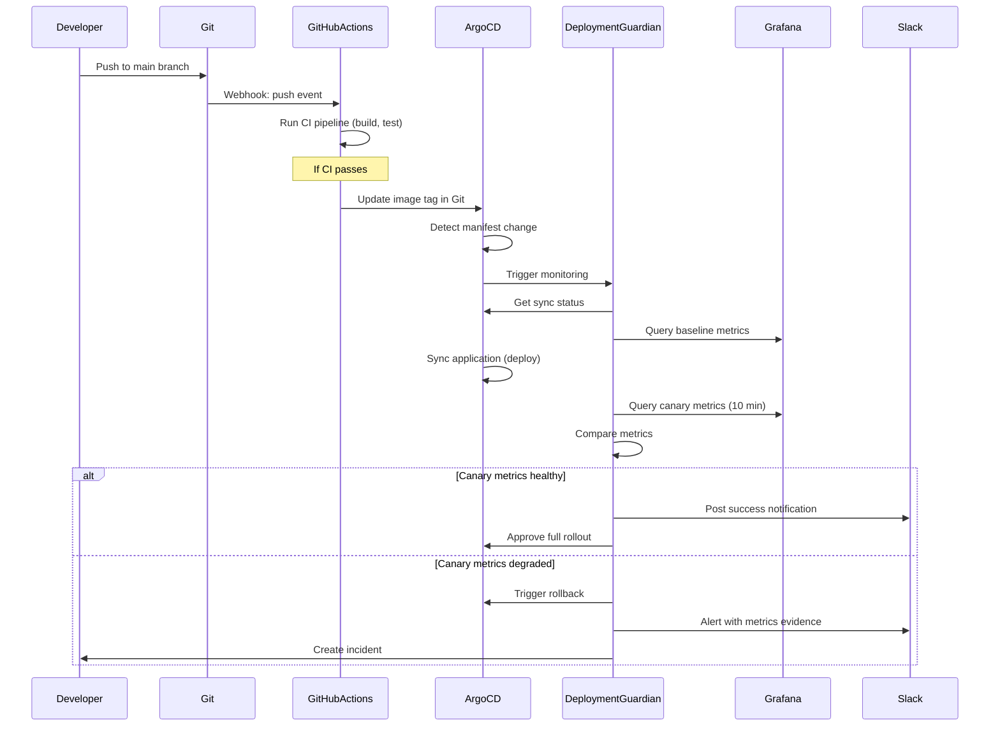
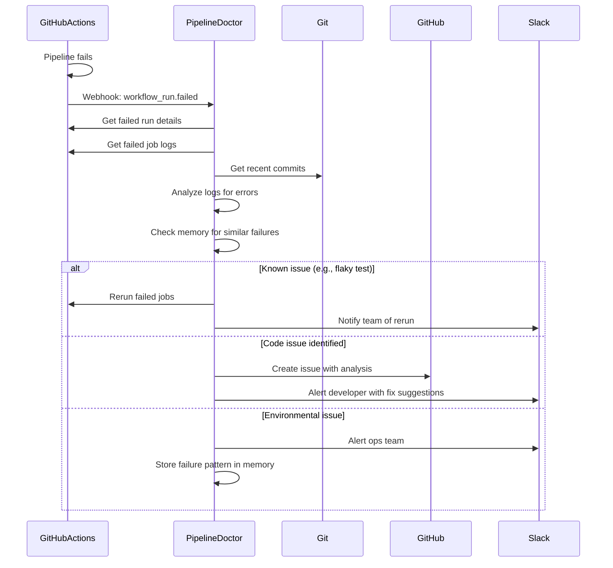
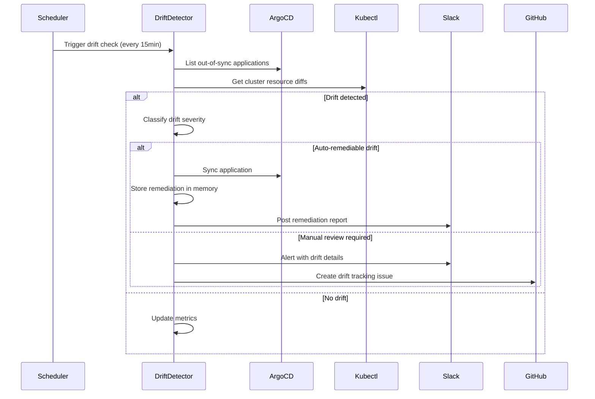

# Phase 3: GitOps & CI/CD - Internal Design Document

**Version**: 0.4.0
**Target Release**: Q2 2025
**Status**: Architecture Design
**Author**: Hive Mind Swarm (ARCHITECT agent)
**Date**: 2025-12-23

---

## Table of Contents

1. [Overview](#1-overview)
2. [New Tools](#2-new-tools)
3. [Tool Operations Matrix](#3-tool-operations-matrix)
4. [Pre-built Agents](#4-pre-built-agents)
5. [Integration Patterns](#5-integration-patterns)
6. [Testing Strategy](#6-testing-strategy)
7. [Migration Guide](#7-migration-guide)
8. [Implementation Roadmap](#8-implementation-roadmap)

---

## 1. Overview

### 1.1 Phase 3 Goals

Phase 3 completes the **deployment lifecycle** by adding:
- **GitOps automation** via ArgoCD and Flux APIs
- **CI/CD orchestration** via GitHub Actions, GitLab CI, and Jenkins
- **Deployment intelligence** via 4 pre-built intelligent agents
- **Continuous delivery workflows** with automated canary analysis and rollback

This transforms AOF from an incident management platform into a **complete deployment automation platform**.

### 1.2 Scope

**In Scope (v0.4.0)**:
- ✅ ArgoCD tool (P0)
- ✅ GitHub Actions tool (P0)
- ✅ Flux tool (P1)
- ✅ GitLab CI tool (P1)
- ✅ Jenkins tool (P2)
- ✅ 4 pre-built agents (deployment-guardian, pipeline-doctor, drift-detector, release-manager)
- ✅ Integration patterns and examples
- ✅ Documentation and tutorials

**Out of Scope (Future Phases)**:
- ❌ CircleCI integration (P2 - v0.4.1)
- ❌ Spinnaker integration (P2 - v0.5.0)
- ❌ Advanced progressive delivery (P2 - v0.5.0)
- ❌ Multi-cluster GitOps coordination (v1.0.0)

### 1.3 Success Metrics

- **Adoption**: 100+ GitHub stars increase
- **Quality**: 85%+ test coverage on new code
- **Performance**: <5s deployment verification latency
- **Documentation**: 100% feature coverage with examples

---

## 2. New Tools

### 2.1 ArgoCD Tool (P0)

#### 2.1.1 Tool Structure

```rust
// crates/aof-tools/src/tools/argocd.rs

/// ArgoCD API tool for GitOps automation
pub struct ArgoCDTool {
    config: ToolConfig,
}

impl ArgoCDTool {
    pub fn new() -> Self {
        let parameters = create_schema(
            serde_json::json!({
                "server": {
                    "type": "string",
                    "description": "ArgoCD server URL (e.g., https://argocd.example.com)"
                },
                "auth_token": {
                    "type": "string",
                    "description": "ArgoCD authentication token"
                },
                "operation": {
                    "type": "string",
                    "description": "Operation to perform",
                    "enum": [
                        "get_application",
                        "list_applications",
                        "sync_application",
                        "get_sync_status",
                        "get_resources",
                        "rollback_application",
                        "terminate_sync",
                        "patch_application",
                        "get_manifest",
                        "get_logs"
                    ]
                },
                "app_name": {
                    "type": "string",
                    "description": "Application name"
                },
                "app_namespace": {
                    "type": "string",
                    "description": "Application namespace (default: argocd)",
                    "default": "argocd"
                },
                "revision": {
                    "type": "string",
                    "description": "Target revision (commit SHA, tag, or branch)"
                },
                "resource_name": {
                    "type": "string",
                    "description": "Specific resource name"
                },
                "resource_kind": {
                    "type": "string",
                    "description": "Resource kind (e.g., Deployment, Service)"
                },
                "prune": {
                    "type": "boolean",
                    "description": "Prune resources during sync",
                    "default": false
                },
                "dry_run": {
                    "type": "boolean",
                    "description": "Perform dry-run",
                    "default": false
                },
                "force": {
                    "type": "boolean",
                    "description": "Force sync even if already synced",
                    "default": false
                },
                "selector": {
                    "type": "string",
                    "description": "Label selector for filtering applications"
                },
                "container": {
                    "type": "string",
                    "description": "Container name for logs"
                }
            }),
            vec!["server", "auth_token", "operation"],
        );

        Self {
            config: tool_config_with_timeout(
                "argocd",
                "Interact with ArgoCD API: manage applications, sync, rollback, monitor deployments",
                parameters,
                60,
            ),
        }
    }
}
```

#### 2.1.2 Supported Operations

```rust
#[async_trait]
impl Tool for ArgoCDTool {
    async fn execute(&self, input: ToolInput) -> AofResult<ToolResult> {
        let server: String = input.get_arg("server")?;
        let auth_token: String = input.get_arg("auth_token")?;
        let operation: String = input.get_arg("operation")?;

        let client = reqwest::Client::builder()
            .timeout(std::time::Duration::from_secs(60))
            .danger_accept_invalid_certs(false)
            .build()
            .map_err(|e| AofError::tool(format!("HTTP client error: {}", e)))?;

        match operation.as_str() {
            "get_application" => {
                self.get_application(&client, &server, &auth_token, &input).await
            }
            "list_applications" => {
                self.list_applications(&client, &server, &auth_token, &input).await
            }
            "sync_application" => {
                self.sync_application(&client, &server, &auth_token, &input).await
            }
            "get_sync_status" => {
                self.get_sync_status(&client, &server, &auth_token, &input).await
            }
            "get_resources" => {
                self.get_resources(&client, &server, &auth_token, &input).await
            }
            "rollback_application" => {
                self.rollback_application(&client, &server, &auth_token, &input).await
            }
            "terminate_sync" => {
                self.terminate_sync(&client, &server, &auth_token, &input).await
            }
            "patch_application" => {
                self.patch_application(&client, &server, &auth_token, &input).await
            }
            "get_manifest" => {
                self.get_manifest(&client, &server, &auth_token, &input).await
            }
            "get_logs" => {
                self.get_logs(&client, &server, &auth_token, &input).await
            }
            _ => Ok(ToolResult::error(format!("Unknown operation: {}", operation))),
        }
    }

    fn config(&self) -> &ToolConfig {
        &self.config
    }
}

impl ArgoCDTool {
    /// Get application details
    async fn get_application(
        &self,
        client: &reqwest::Client,
        server: &str,
        auth_token: &str,
        input: &ToolInput,
    ) -> AofResult<ToolResult> {
        let app_name: String = input.get_arg("app_name")?;
        let app_namespace: String = input.get_arg("app_namespace")
            .unwrap_or_else(|_| "argocd".to_string());

        let url = format!(
            "{}/api/v1/applications/{}/{}",
            server.trim_end_matches('/'),
            app_namespace,
            app_name
        );

        let response = client
            .get(&url)
            .header("Authorization", format!("Bearer {}", auth_token))
            .send()
            .await
            .map_err(|e| AofError::tool(format!("Request failed: {}", e)))?;

        if !response.status().is_success() {
            return Ok(ToolResult::error(format!(
                "ArgoCD API error: {}",
                response.status()
            )));
        }

        let app: serde_json::Value = response.json().await
            .map_err(|e| AofError::tool(format!("Parse error: {}", e)))?;

        Ok(ToolResult::success(app))
    }

    /// List all applications
    async fn list_applications(
        &self,
        client: &reqwest::Client,
        server: &str,
        auth_token: &str,
        input: &ToolInput,
    ) -> AofResult<ToolResult> {
        let selector: Option<String> = input.get_arg("selector").ok();

        let url = format!("{}/api/v1/applications", server.trim_end_matches('/'));

        let mut request = client
            .get(&url)
            .header("Authorization", format!("Bearer {}", auth_token));

        if let Some(sel) = selector {
            request = request.query(&[("selector", sel)]);
        }

        let response = request.send().await
            .map_err(|e| AofError::tool(format!("Request failed: {}", e)))?;

        if !response.status().is_success() {
            return Ok(ToolResult::error(format!(
                "ArgoCD API error: {}",
                response.status()
            )));
        }

        let apps: serde_json::Value = response.json().await
            .map_err(|e| AofError::tool(format!("Parse error: {}", e)))?;

        Ok(ToolResult::success(apps))
    }

    /// Sync application
    async fn sync_application(
        &self,
        client: &reqwest::Client,
        server: &str,
        auth_token: &str,
        input: &ToolInput,
    ) -> AofResult<ToolResult> {
        let app_name: String = input.get_arg("app_name")?;
        let app_namespace: String = input.get_arg("app_namespace")
            .unwrap_or_else(|_| "argocd".to_string());
        let revision: Option<String> = input.get_arg("revision").ok();
        let prune: bool = input.get_arg("prune").unwrap_or(false);
        let dry_run: bool = input.get_arg("dry_run").unwrap_or(false);
        let force: bool = input.get_arg("force").unwrap_or(false);

        let url = format!(
            "{}/api/v1/applications/{}/{}/sync",
            server.trim_end_matches('/'),
            app_namespace,
            app_name
        );

        let mut payload = serde_json::json!({
            "prune": prune,
            "dryRun": dry_run,
            "strategy": {
                "hook": {
                    "force": force
                }
            }
        });

        if let Some(rev) = revision {
            payload["revision"] = serde_json::json!(rev);
        }

        let response = client
            .post(&url)
            .header("Authorization", format!("Bearer {}", auth_token))
            .header("Content-Type", "application/json")
            .json(&payload)
            .send()
            .await
            .map_err(|e| AofError::tool(format!("Request failed: {}", e)))?;

        if !response.status().is_success() {
            return Ok(ToolResult::error(format!(
                "Sync failed: {}",
                response.status()
            )));
        }

        let result: serde_json::Value = response.json().await
            .map_err(|e| AofError::tool(format!("Parse error: {}", e)))?;

        Ok(ToolResult::success(result))
    }

    /// Get sync status
    async fn get_sync_status(
        &self,
        client: &reqwest::Client,
        server: &str,
        auth_token: &str,
        input: &ToolInput,
    ) -> AofResult<ToolResult> {
        let app_name: String = input.get_arg("app_name")?;
        let app_namespace: String = input.get_arg("app_namespace")
            .unwrap_or_else(|_| "argocd".to_string());

        let url = format!(
            "{}/api/v1/applications/{}/{}",
            server.trim_end_matches('/'),
            app_namespace,
            app_name
        );

        let response = client
            .get(&url)
            .header("Authorization", format!("Bearer {}", auth_token))
            .send()
            .await
            .map_err(|e| AofError::tool(format!("Request failed: {}", e)))?;

        if !response.status().is_success() {
            return Ok(ToolResult::error(format!(
                "Failed to get status: {}",
                response.status()
            )));
        }

        let app: serde_json::Value = response.json().await
            .map_err(|e| AofError::tool(format!("Parse error: {}", e)))?;

        let status = serde_json::json!({
            "sync": app.get("status").and_then(|s| s.get("sync")),
            "health": app.get("status").and_then(|s| s.get("health")),
            "operationState": app.get("status").and_then(|s| s.get("operationState"))
        });

        Ok(ToolResult::success(status))
    }

    /// Get application resources
    async fn get_resources(
        &self,
        client: &reqwest::Client,
        server: &str,
        auth_token: &str,
        input: &ToolInput,
    ) -> AofResult<ToolResult> {
        let app_name: String = input.get_arg("app_name")?;
        let app_namespace: String = input.get_arg("app_namespace")
            .unwrap_or_else(|_| "argocd".to_string());

        let url = format!(
            "{}/api/v1/applications/{}/{}/resource-tree",
            server.trim_end_matches('/'),
            app_namespace,
            app_name
        );

        let response = client
            .get(&url)
            .header("Authorization", format!("Bearer {}", auth_token))
            .send()
            .await
            .map_err(|e| AofError::tool(format!("Request failed: {}", e)))?;

        if !response.status().is_success() {
            return Ok(ToolResult::error(format!(
                "Failed to get resources: {}",
                response.status()
            )));
        }

        let resources: serde_json::Value = response.json().await
            .map_err(|e| AofError::tool(format!("Parse error: {}", e)))?;

        Ok(ToolResult::success(resources))
    }

    /// Rollback application
    async fn rollback_application(
        &self,
        client: &reqwest::Client,
        server: &str,
        auth_token: &str,
        input: &ToolInput,
    ) -> AofResult<ToolResult> {
        let app_name: String = input.get_arg("app_name")?;
        let app_namespace: String = input.get_arg("app_namespace")
            .unwrap_or_else(|_| "argocd".to_string());

        let url = format!(
            "{}/api/v1/applications/{}/{}/rollback",
            server.trim_end_matches('/'),
            app_namespace,
            app_name
        );

        let response = client
            .post(&url)
            .header("Authorization", format!("Bearer {}", auth_token))
            .send()
            .await
            .map_err(|e| AofError::tool(format!("Request failed: {}", e)))?;

        if !response.status().is_success() {
            return Ok(ToolResult::error(format!(
                "Rollback failed: {}",
                response.status()
            )));
        }

        let result: serde_json::Value = response.json().await
            .map_err(|e| AofError::tool(format!("Parse error: {}", e)))?;

        Ok(ToolResult::success(result))
    }

    /// Terminate ongoing sync
    async fn terminate_sync(
        &self,
        client: &reqwest::Client,
        server: &str,
        auth_token: &str,
        input: &ToolInput,
    ) -> AofResult<ToolResult> {
        let app_name: String = input.get_arg("app_name")?;
        let app_namespace: String = input.get_arg("app_namespace")
            .unwrap_or_else(|_| "argocd".to_string());

        let url = format!(
            "{}/api/v1/applications/{}/{}/operation",
            server.trim_end_matches('/'),
            app_namespace,
            app_name
        );

        let response = client
            .delete(&url)
            .header("Authorization", format!("Bearer {}", auth_token))
            .send()
            .await
            .map_err(|e| AofError::tool(format!("Request failed: {}", e)))?;

        if !response.status().is_success() {
            return Ok(ToolResult::error(format!(
                "Terminate failed: {}",
                response.status()
            )));
        }

        Ok(ToolResult::success(serde_json::json!({
            "status": "terminated",
            "application": app_name
        })))
    }

    /// Get application manifest
    async fn get_manifest(
        &self,
        client: &reqwest::Client,
        server: &str,
        auth_token: &str,
        input: &ToolInput,
    ) -> AofResult<ToolResult> {
        let app_name: String = input.get_arg("app_name")?;
        let app_namespace: String = input.get_arg("app_namespace")
            .unwrap_or_else(|_| "argocd".to_string());
        let revision: Option<String> = input.get_arg("revision").ok();

        let url = format!(
            "{}/api/v1/applications/{}/{}/manifests",
            server.trim_end_matches('/'),
            app_namespace,
            app_name
        );

        let mut request = client
            .get(&url)
            .header("Authorization", format!("Bearer {}", auth_token));

        if let Some(rev) = revision {
            request = request.query(&[("revision", rev)]);
        }

        let response = request.send().await
            .map_err(|e| AofError::tool(format!("Request failed: {}", e)))?;

        if !response.status().is_success() {
            return Ok(ToolResult::error(format!(
                "Failed to get manifest: {}",
                response.status()
            )));
        }

        let manifest: serde_json::Value = response.json().await
            .map_err(|e| AofError::tool(format!("Parse error: {}", e)))?;

        Ok(ToolResult::success(manifest))
    }

    /// Get application logs
    async fn get_logs(
        &self,
        client: &reqwest::Client,
        server: &str,
        auth_token: &str,
        input: &ToolInput,
    ) -> AofResult<ToolResult> {
        let app_name: String = input.get_arg("app_name")?;
        let app_namespace: String = input.get_arg("app_namespace")
            .unwrap_or_else(|_| "argocd".to_string());
        let resource_name: Option<String> = input.get_arg("resource_name").ok();
        let container: Option<String> = input.get_arg("container").ok();

        let url = format!(
            "{}/api/v1/applications/{}/{}/logs",
            server.trim_end_matches('/'),
            app_namespace,
            app_name
        );

        let mut request = client
            .get(&url)
            .header("Authorization", format!("Bearer {}", auth_token));

        if let Some(res) = resource_name {
            request = request.query(&[("resourceName", res)]);
        }
        if let Some(cont) = container {
            request = request.query(&[("container", cont)]);
        }

        let response = request.send().await
            .map_err(|e| AofError::tool(format!("Request failed: {}", e)))?;

        if !response.status().is_success() {
            return Ok(ToolResult::error(format!(
                "Failed to get logs: {}",
                response.status()
            )));
        }

        let logs: serde_json::Value = response.json().await
            .map_err(|e| AofError::tool(format!("Parse error: {}", e)))?;

        Ok(ToolResult::success(logs))
    }
}
```

### 2.2 GitHub Actions Tool (P0)

#### 2.2.1 Tool Structure

```rust
// crates/aof-tools/src/tools/github_actions.rs

/// GitHub Actions API tool
pub struct GitHubActionsTool {
    config: ToolConfig,
}

impl GitHubActionsTool {
    pub fn new() -> Self {
        let parameters = create_schema(
            serde_json::json!({
                "token": {
                    "type": "string",
                    "description": "GitHub personal access token or GitHub App token"
                },
                "operation": {
                    "type": "string",
                    "description": "Operation to perform",
                    "enum": [
                        "list_workflow_runs",
                        "get_workflow_run",
                        "list_jobs",
                        "get_job",
                        "get_job_logs",
                        "cancel_workflow_run",
                        "rerun_workflow",
                        "rerun_failed_jobs",
                        "trigger_workflow",
                        "list_artifacts",
                        "download_artifact"
                    ]
                },
                "owner": {
                    "type": "string",
                    "description": "Repository owner (username or org)"
                },
                "repo": {
                    "type": "string",
                    "description": "Repository name"
                },
                "workflow_id": {
                    "type": "string",
                    "description": "Workflow ID or filename (e.g., 'ci.yml')"
                },
                "run_id": {
                    "type": "integer",
                    "description": "Workflow run ID"
                },
                "job_id": {
                    "type": "integer",
                    "description": "Job ID"
                },
                "artifact_id": {
                    "type": "integer",
                    "description": "Artifact ID"
                },
                "branch": {
                    "type": "string",
                    "description": "Branch name for filtering"
                },
                "event": {
                    "type": "string",
                    "description": "Event type for filtering (push, pull_request, etc.)"
                },
                "status": {
                    "type": "string",
                    "description": "Status filter (queued, in_progress, completed)",
                    "enum": ["queued", "in_progress", "completed"]
                },
                "conclusion": {
                    "type": "string",
                    "description": "Conclusion filter (success, failure, cancelled)",
                    "enum": ["success", "failure", "cancelled", "skipped"]
                },
                "per_page": {
                    "type": "integer",
                    "description": "Results per page (max 100)",
                    "default": 30
                },
                "ref": {
                    "type": "string",
                    "description": "Git ref (branch/tag) to trigger workflow on"
                },
                "inputs": {
                    "type": "object",
                    "description": "Workflow dispatch inputs (key-value pairs)"
                }
            }),
            vec!["token", "operation", "owner", "repo"],
        );

        Self {
            config: tool_config_with_timeout(
                "github_actions",
                "Interact with GitHub Actions API: manage workflow runs, jobs, artifacts, and triggering",
                parameters,
                90,
            ),
        }
    }
}
```

#### 2.2.2 Supported Operations

```rust
#[async_trait]
impl Tool for GitHubActionsTool {
    async fn execute(&self, input: ToolInput) -> AofResult<ToolResult> {
        let token: String = input.get_arg("token")?;
        let operation: String = input.get_arg("operation")?;
        let owner: String = input.get_arg("owner")?;
        let repo: String = input.get_arg("repo")?;

        let client = reqwest::Client::builder()
            .timeout(std::time::Duration::from_secs(90))
            .user_agent("aof-github-actions-tool")
            .build()
            .map_err(|e| AofError::tool(format!("HTTP client error: {}", e)))?;

        match operation.as_str() {
            "list_workflow_runs" => {
                self.list_workflow_runs(&client, &token, &owner, &repo, &input).await
            }
            "get_workflow_run" => {
                self.get_workflow_run(&client, &token, &owner, &repo, &input).await
            }
            "list_jobs" => {
                self.list_jobs(&client, &token, &owner, &repo, &input).await
            }
            "get_job" => {
                self.get_job(&client, &token, &owner, &repo, &input).await
            }
            "get_job_logs" => {
                self.get_job_logs(&client, &token, &owner, &repo, &input).await
            }
            "cancel_workflow_run" => {
                self.cancel_workflow_run(&client, &token, &owner, &repo, &input).await
            }
            "rerun_workflow" => {
                self.rerun_workflow(&client, &token, &owner, &repo, &input).await
            }
            "rerun_failed_jobs" => {
                self.rerun_failed_jobs(&client, &token, &owner, &repo, &input).await
            }
            "trigger_workflow" => {
                self.trigger_workflow(&client, &token, &owner, &repo, &input).await
            }
            "list_artifacts" => {
                self.list_artifacts(&client, &token, &owner, &repo, &input).await
            }
            "download_artifact" => {
                self.download_artifact(&client, &token, &owner, &repo, &input).await
            }
            _ => Ok(ToolResult::error(format!("Unknown operation: {}", operation))),
        }
    }

    fn config(&self) -> &ToolConfig {
        &self.config
    }
}

impl GitHubActionsTool {
    /// List workflow runs
    async fn list_workflow_runs(
        &self,
        client: &reqwest::Client,
        token: &str,
        owner: &str,
        repo: &str,
        input: &ToolInput,
    ) -> AofResult<ToolResult> {
        let workflow_id: Option<String> = input.get_arg("workflow_id").ok();
        let branch: Option<String> = input.get_arg("branch").ok();
        let event: Option<String> = input.get_arg("event").ok();
        let status: Option<String> = input.get_arg("status").ok();
        let per_page: i64 = input.get_arg("per_page").unwrap_or(30);

        let base_url = if let Some(wf_id) = workflow_id {
            format!(
                "https://api.github.com/repos/{}/{}/actions/workflows/{}/runs",
                owner, repo, wf_id
            )
        } else {
            format!(
                "https://api.github.com/repos/{}/{}/actions/runs",
                owner, repo
            )
        };

        let mut request = client
            .get(&base_url)
            .header("Authorization", format!("Bearer {}", token))
            .header("Accept", "application/vnd.github.v3+json");

        if let Some(br) = branch {
            request = request.query(&[("branch", br)]);
        }
        if let Some(ev) = event {
            request = request.query(&[("event", ev)]);
        }
        if let Some(st) = status {
            request = request.query(&[("status", st)]);
        }
        request = request.query(&[("per_page", per_page.to_string())]);

        let response = request.send().await
            .map_err(|e| AofError::tool(format!("Request failed: {}", e)))?;

        if !response.status().is_success() {
            return Ok(ToolResult::error(format!(
                "GitHub API error: {}",
                response.status()
            )));
        }

        let runs: serde_json::Value = response.json().await
            .map_err(|e| AofError::tool(format!("Parse error: {}", e)))?;

        Ok(ToolResult::success(runs))
    }

    /// Get specific workflow run
    async fn get_workflow_run(
        &self,
        client: &reqwest::Client,
        token: &str,
        owner: &str,
        repo: &str,
        input: &ToolInput,
    ) -> AofResult<ToolResult> {
        let run_id: i64 = input.get_arg("run_id")?;

        let url = format!(
            "https://api.github.com/repos/{}/{}/actions/runs/{}",
            owner, repo, run_id
        );

        let response = client
            .get(&url)
            .header("Authorization", format!("Bearer {}", token))
            .header("Accept", "application/vnd.github.v3+json")
            .send()
            .await
            .map_err(|e| AofError::tool(format!("Request failed: {}", e)))?;

        if !response.status().is_success() {
            return Ok(ToolResult::error(format!(
                "Workflow run not found: {}",
                response.status()
            )));
        }

        let run: serde_json::Value = response.json().await
            .map_err(|e| AofError::tool(format!("Parse error: {}", e)))?;

        Ok(ToolResult::success(run))
    }

    /// List jobs for a workflow run
    async fn list_jobs(
        &self,
        client: &reqwest::Client,
        token: &str,
        owner: &str,
        repo: &str,
        input: &ToolInput,
    ) -> AofResult<ToolResult> {
        let run_id: i64 = input.get_arg("run_id")?;

        let url = format!(
            "https://api.github.com/repos/{}/{}/actions/runs/{}/jobs",
            owner, repo, run_id
        );

        let response = client
            .get(&url)
            .header("Authorization", format!("Bearer {}", token))
            .header("Accept", "application/vnd.github.v3+json")
            .send()
            .await
            .map_err(|e| AofError::tool(format!("Request failed: {}", e)))?;

        if !response.status().is_success() {
            return Ok(ToolResult::error(format!(
                "Failed to list jobs: {}",
                response.status()
            )));
        }

        let jobs: serde_json::Value = response.json().await
            .map_err(|e| AofError::tool(format!("Parse error: {}", e)))?;

        Ok(ToolResult::success(jobs))
    }

    /// Get specific job
    async fn get_job(
        &self,
        client: &reqwest::Client,
        token: &str,
        owner: &str,
        repo: &str,
        input: &ToolInput,
    ) -> AofResult<ToolResult> {
        let job_id: i64 = input.get_arg("job_id")?;

        let url = format!(
            "https://api.github.com/repos/{}/{}/actions/jobs/{}",
            owner, repo, job_id
        );

        let response = client
            .get(&url)
            .header("Authorization", format!("Bearer {}", token))
            .header("Accept", "application/vnd.github.v3+json")
            .send()
            .await
            .map_err(|e| AofError::tool(format!("Request failed: {}", e)))?;

        if !response.status().is_success() {
            return Ok(ToolResult::error(format!(
                "Job not found: {}",
                response.status()
            )));
        }

        let job: serde_json::Value = response.json().await
            .map_err(|e| AofError::tool(format!("Parse error: {}", e)))?;

        Ok(ToolResult::success(job))
    }

    /// Get job logs
    async fn get_job_logs(
        &self,
        client: &reqwest::Client,
        token: &str,
        owner: &str,
        repo: &str,
        input: &ToolInput,
    ) -> AofResult<ToolResult> {
        let job_id: i64 = input.get_arg("job_id")?;

        let url = format!(
            "https://api.github.com/repos/{}/{}/actions/jobs/{}/logs",
            owner, repo, job_id
        );

        let response = client
            .get(&url)
            .header("Authorization", format!("Bearer {}", token))
            .header("Accept", "application/vnd.github.v3+json")
            .send()
            .await
            .map_err(|e| AofError::tool(format!("Request failed: {}", e)))?;

        if !response.status().is_success() {
            return Ok(ToolResult::error(format!(
                "Failed to get logs: {}",
                response.status()
            )));
        }

        let logs = response.text().await
            .map_err(|e| AofError::tool(format!("Failed to read logs: {}", e)))?;

        Ok(ToolResult::success(serde_json::json!({
            "job_id": job_id,
            "logs": logs
        })))
    }

    /// Cancel workflow run
    async fn cancel_workflow_run(
        &self,
        client: &reqwest::Client,
        token: &str,
        owner: &str,
        repo: &str,
        input: &ToolInput,
    ) -> AofResult<ToolResult> {
        let run_id: i64 = input.get_arg("run_id")?;

        let url = format!(
            "https://api.github.com/repos/{}/{}/actions/runs/{}/cancel",
            owner, repo, run_id
        );

        let response = client
            .post(&url)
            .header("Authorization", format!("Bearer {}", token))
            .header("Accept", "application/vnd.github.v3+json")
            .send()
            .await
            .map_err(|e| AofError::tool(format!("Request failed: {}", e)))?;

        if !response.status().is_success() {
            return Ok(ToolResult::error(format!(
                "Cancel failed: {}",
                response.status()
            )));
        }

        Ok(ToolResult::success(serde_json::json!({
            "status": "cancelled",
            "run_id": run_id
        })))
    }

    /// Rerun workflow
    async fn rerun_workflow(
        &self,
        client: &reqwest::Client,
        token: &str,
        owner: &str,
        repo: &str,
        input: &ToolInput,
    ) -> AofResult<ToolResult> {
        let run_id: i64 = input.get_arg("run_id")?;

        let url = format!(
            "https://api.github.com/repos/{}/{}/actions/runs/{}/rerun",
            owner, repo, run_id
        );

        let response = client
            .post(&url)
            .header("Authorization", format!("Bearer {}", token))
            .header("Accept", "application/vnd.github.v3+json")
            .send()
            .await
            .map_err(|e| AofError::tool(format!("Request failed: {}", e)))?;

        if !response.status().is_success() {
            return Ok(ToolResult::error(format!(
                "Rerun failed: {}",
                response.status()
            )));
        }

        Ok(ToolResult::success(serde_json::json!({
            "status": "rerun_triggered",
            "run_id": run_id
        })))
    }

    /// Rerun failed jobs only
    async fn rerun_failed_jobs(
        &self,
        client: &reqwest::Client,
        token: &str,
        owner: &str,
        repo: &str,
        input: &ToolInput,
    ) -> AofResult<ToolResult> {
        let run_id: i64 = input.get_arg("run_id")?;

        let url = format!(
            "https://api.github.com/repos/{}/{}/actions/runs/{}/rerun-failed-jobs",
            owner, repo, run_id
        );

        let response = client
            .post(&url)
            .header("Authorization", format!("Bearer {}", token))
            .header("Accept", "application/vnd.github.v3+json")
            .send()
            .await
            .map_err(|e| AofError::tool(format!("Request failed: {}", e)))?;

        if !response.status().is_success() {
            return Ok(ToolResult::error(format!(
                "Rerun failed: {}",
                response.status()
            )));
        }

        Ok(ToolResult::success(serde_json::json!({
            "status": "failed_jobs_rerun",
            "run_id": run_id
        })))
    }

    /// Trigger workflow dispatch
    async fn trigger_workflow(
        &self,
        client: &reqwest::Client,
        token: &str,
        owner: &str,
        repo: &str,
        input: &ToolInput,
    ) -> AofResult<ToolResult> {
        let workflow_id: String = input.get_arg("workflow_id")?;
        let ref_name: String = input.get_arg("ref")?;
        let inputs: Option<serde_json::Value> = input.get_arg("inputs").ok();

        let url = format!(
            "https://api.github.com/repos/{}/{}/actions/workflows/{}/dispatches",
            owner, repo, workflow_id
        );

        let mut payload = serde_json::json!({
            "ref": ref_name
        });

        if let Some(inp) = inputs {
            payload["inputs"] = inp;
        }

        let response = client
            .post(&url)
            .header("Authorization", format!("Bearer {}", token))
            .header("Accept", "application/vnd.github.v3+json")
            .header("Content-Type", "application/json")
            .json(&payload)
            .send()
            .await
            .map_err(|e| AofError::tool(format!("Request failed: {}", e)))?;

        if !response.status().is_success() {
            return Ok(ToolResult::error(format!(
                "Workflow trigger failed: {}",
                response.status()
            )));
        }

        Ok(ToolResult::success(serde_json::json!({
            "status": "triggered",
            "workflow_id": workflow_id,
            "ref": ref_name
        })))
    }

    /// List artifacts
    async fn list_artifacts(
        &self,
        client: &reqwest::Client,
        token: &str,
        owner: &str,
        repo: &str,
        input: &ToolInput,
    ) -> AofResult<ToolResult> {
        let run_id: Option<i64> = input.get_arg("run_id").ok();

        let url = if let Some(rid) = run_id {
            format!(
                "https://api.github.com/repos/{}/{}/actions/runs/{}/artifacts",
                owner, repo, rid
            )
        } else {
            format!(
                "https://api.github.com/repos/{}/{}/actions/artifacts",
                owner, repo
            )
        };

        let response = client
            .get(&url)
            .header("Authorization", format!("Bearer {}", token))
            .header("Accept", "application/vnd.github.v3+json")
            .send()
            .await
            .map_err(|e| AofError::tool(format!("Request failed: {}", e)))?;

        if !response.status().is_success() {
            return Ok(ToolResult::error(format!(
                "Failed to list artifacts: {}",
                response.status()
            )));
        }

        let artifacts: serde_json::Value = response.json().await
            .map_err(|e| AofError::tool(format!("Parse error: {}", e)))?;

        Ok(ToolResult::success(artifacts))
    }

    /// Download artifact (returns download URL)
    async fn download_artifact(
        &self,
        client: &reqwest::Client,
        token: &str,
        owner: &str,
        repo: &str,
        input: &ToolInput,
    ) -> AofResult<ToolResult> {
        let artifact_id: i64 = input.get_arg("artifact_id")?;

        let url = format!(
            "https://api.github.com/repos/{}/{}/actions/artifacts/{}/zip",
            owner, repo, artifact_id
        );

        // GitHub returns a redirect to the download URL
        let response = client
            .get(&url)
            .header("Authorization", format!("Bearer {}", token))
            .header("Accept", "application/vnd.github.v3+json")
            .send()
            .await
            .map_err(|e| AofError::tool(format!("Request failed: {}", e)))?;

        if !response.status().is_success() {
            return Ok(ToolResult::error(format!(
                "Download failed: {}",
                response.status()
            )));
        }

        Ok(ToolResult::success(serde_json::json!({
            "artifact_id": artifact_id,
            "download_url": url,
            "note": "Use this URL to download the artifact (requires authentication)"
        })))
    }
}
```

### 2.3 Flux Tool (P1)

#### 2.3.1 Tool Structure

```rust
// crates/aof-tools/src/tools/flux.rs

/// Flux GitOps tool (uses kubectl + flux CLI)
pub struct FluxTool {
    config: ToolConfig,
}

impl FluxTool {
    pub fn new() -> Self {
        let parameters = create_schema(
            serde_json::json!({
                "operation": {
                    "type": "string",
                    "description": "Operation to perform",
                    "enum": [
                        "get_kustomizations",
                        "get_kustomization",
                        "reconcile_kustomization",
                        "suspend_kustomization",
                        "resume_kustomization",
                        "get_helmreleases",
                        "get_helmrelease",
                        "reconcile_helmrelease",
                        "suspend_helmrelease",
                        "resume_helmrelease",
                        "get_sources",
                        "reconcile_source",
                        "get_alerts",
                        "get_logs"
                    ]
                },
                "namespace": {
                    "type": "string",
                    "description": "Kubernetes namespace",
                    "default": "flux-system"
                },
                "name": {
                    "type": "string",
                    "description": "Resource name"
                },
                "source_kind": {
                    "type": "string",
                    "description": "Source kind (GitRepository, HelmRepository, Bucket)",
                    "enum": ["GitRepository", "HelmRepository", "Bucket", "OCIRepository"]
                },
                "all_namespaces": {
                    "type": "boolean",
                    "description": "Query all namespaces",
                    "default": false
                },
                "kubeconfig": {
                    "type": "string",
                    "description": "Path to kubeconfig file"
                },
                "context": {
                    "type": "string",
                    "description": "Kubernetes context to use"
                }
            }),
            vec!["operation"],
        );

        Self {
            config: tool_config_with_timeout(
                "flux",
                "Interact with Flux GitOps: manage Kustomizations, HelmReleases, sources, and reconciliation",
                parameters,
                60,
            ),
        }
    }
}
```

**(Continued in next section...)**

---

## 3. Tool Operations Matrix

### 3.1 ArgoCD Tool Operations

| Operation | Input | Output | Use Case |
|-----------|-------|--------|----------|
| `get_application` | app_name, app_namespace | Application details (spec, status, health) | Check deployment status |
| `list_applications` | selector (optional) | List of applications | Discover all apps |
| `sync_application` | app_name, revision, prune, dry_run | Sync operation status | Trigger deployment |
| `get_sync_status` | app_name | Sync status, health status | Monitor deployment |
| `get_resources` | app_name | Resource tree (K8s resources) | Inspect deployed resources |
| `rollback_application` | app_name | Rollback operation status | Revert bad deployment |
| `terminate_sync` | app_name | Termination confirmation | Stop ongoing sync |
| `patch_application` | app_name, patch_data | Updated application | Modify app config |
| `get_manifest` | app_name, revision | Rendered manifests | Preview deployment |
| `get_logs` | app_name, resource_name, container | Pod logs | Debug deployment |

### 3.2 GitHub Actions Tool Operations

| Operation | Input | Output | Use Case |
|-----------|-------|--------|----------|
| `list_workflow_runs` | workflow_id, branch, event, status | List of runs | Monitor CI/CD pipelines |
| `get_workflow_run` | run_id | Run details (status, jobs, logs) | Check specific run |
| `list_jobs` | run_id | List of jobs in run | See job breakdown |
| `get_job` | job_id | Job details (steps, status) | Inspect specific job |
| `get_job_logs` | job_id | Raw job logs | Debug failures |
| `cancel_workflow_run` | run_id | Cancellation confirmation | Stop running workflow |
| `rerun_workflow` | run_id | Rerun confirmation | Retry failed run |
| `rerun_failed_jobs` | run_id | Rerun confirmation | Retry only failed jobs |
| `trigger_workflow` | workflow_id, ref, inputs | Trigger confirmation | Manually trigger workflow |
| `list_artifacts` | run_id (optional) | List of artifacts | Find build outputs |
| `download_artifact` | artifact_id | Download URL | Retrieve artifacts |

### 3.3 Flux Tool Operations

| Operation | Input | Output | Use Case |
|-----------|-------|--------|----------|
| `get_kustomizations` | namespace, all_namespaces | List of Kustomizations | Discover deployments |
| `get_kustomization` | name, namespace | Kustomization details | Check status |
| `reconcile_kustomization` | name, namespace | Reconcile status | Force sync |
| `suspend_kustomization` | name, namespace | Suspension confirmation | Pause automation |
| `resume_kustomization` | name, namespace | Resume confirmation | Unpause automation |
| `get_helmreleases` | namespace, all_namespaces | List of HelmReleases | Discover Helm deployments |
| `get_helmrelease` | name, namespace | HelmRelease details | Check Helm status |
| `reconcile_helmrelease` | name, namespace | Reconcile status | Force Helm sync |
| `suspend_helmrelease` | name, namespace | Suspension confirmation | Pause Helm |
| `resume_helmrelease` | name, namespace | Resume confirmation | Unpause Helm |
| `get_sources` | source_kind, namespace | List of sources | Check Git/Helm sources |
| `reconcile_source` | source_kind, name, namespace | Reconcile status | Force source update |
| `get_alerts` | namespace, all_namespaces | List of alerts | Monitor Flux alerts |
| `get_logs` | component, namespace | Component logs | Debug Flux |

### 3.4 GitLab CI Tool Operations

| Operation | Input | Output | Use Case |
|-----------|-------|--------|----------|
| `list_pipelines` | project_id, ref, status | List of pipelines | Monitor CI/CD |
| `get_pipeline` | project_id, pipeline_id | Pipeline details | Check pipeline |
| `get_pipeline_jobs` | project_id, pipeline_id | List of jobs | See job breakdown |
| `get_job` | project_id, job_id | Job details | Inspect job |
| `get_job_logs` | project_id, job_id | Job logs | Debug failures |
| `retry_pipeline` | project_id, pipeline_id | Retry confirmation | Retry failed pipeline |
| `cancel_pipeline` | project_id, pipeline_id | Cancel confirmation | Stop pipeline |
| `trigger_pipeline` | project_id, ref, variables | Trigger confirmation | Manual trigger |
| `download_artifact` | project_id, job_id, artifact_path | Artifact content | Retrieve build output |

### 3.5 Jenkins Tool Operations

| Operation | Input | Output | Use Case |
|-----------|-------|--------|----------|
| `list_jobs` | folder (optional) | List of jobs | Discover jobs |
| `get_job` | job_name | Job details | Check job config |
| `get_build` | job_name, build_number | Build details | Inspect build |
| `get_build_logs` | job_name, build_number | Console logs | Debug failures |
| `trigger_build` | job_name, parameters | Build number | Trigger build |
| `stop_build` | job_name, build_number | Stop confirmation | Cancel build |
| `get_queue` | - | Build queue | Check pending builds |
| `get_nodes` | - | List of agents | Monitor Jenkins agents |
| `disable_job` | job_name | Disable confirmation | Pause job |
| `enable_job` | job_name | Enable confirmation | Unpause job |

---

## 4. Pre-built Agents

### 4.1 Deployment Guardian Agent

**File**: `examples/agents/deployment-guardian.yaml`

```yaml
apiVersion: aof.dev/v1
kind: Agent
metadata:
  name: deployment-guardian
  description: |
    Monitor deployments via ArgoCD/Flux, perform canary analysis using metrics,
    and automatically rollback if anomalies detected.
  labels:
    category: deployment
    domain: gitops
    priority: p0

spec:
  model:
    provider: google
    name: gemini-2.5-flash
    temperature: 0.2
    max_tokens: 8000

  system_prompt: |
    You are a deployment safety guardian. Your job is to:

    1. **Monitor Deployments**:
       - Watch ArgoCD/Flux applications for sync operations
       - Track deployment progress (health, sync status)
       - Identify when new revisions are deployed

    2. **Canary Analysis**:
       - Query metrics during canary phase (error rate, latency, saturation)
       - Compare new version metrics vs. baseline
       - Use statistical significance tests (t-test, chi-square)
       - Look for: error rate >5% increase, p99 latency >20% increase

    3. **Automated Rollback**:
       - If canary fails, immediately rollback to previous revision
       - Document rollback reason with metrics evidence
       - Post findings to Slack/incident channel
       - Create incident if rollback also fails

    4. **Progressive Delivery**:
       - If canary passes, recommend increasing traffic percentage
       - Monitor until 100% rollout
       - Mark deployment as successful

    Use tools to query ArgoCD, Grafana, and kubectl. Be conservative - safety first.

  tools:
    - argocd
    - flux
    - grafana
    - prometheus_query
    - kubectl
    - slack

  memory:
    provider: sqlite
    config:
      path: "./memory/deployment-guardian.db"

  config:
    argocd_server: "${ARGOCD_SERVER}"
    argocd_token: "${ARGOCD_AUTH_TOKEN}"
    grafana_endpoint: "${GRAFANA_URL}"
    grafana_api_key: "${GRAFANA_API_KEY}"
    prometheus_endpoint: "${PROMETHEUS_URL}"
    slack_token: "${SLACK_BOT_TOKEN}"
    canary_duration_minutes: 10
    error_rate_threshold: 5.0  # percent
    latency_increase_threshold: 20.0  # percent
```

### 4.2 Pipeline Doctor Agent

**File**: `examples/agents/pipeline-doctor.yaml`

```yaml
apiVersion: aof.dev/v1
kind: Agent
metadata:
  name: pipeline-doctor
  description: |
    Diagnose CI/CD pipeline failures, perform root cause analysis,
    and suggest fixes based on logs and common patterns.
  labels:
    category: cicd
    domain: troubleshooting
    priority: p0

spec:
  model:
    provider: google
    name: gemini-2.5-flash
    temperature: 0.3
    max_tokens: 8000

  system_prompt: |
    You are a CI/CD pipeline troubleshooting expert. When a pipeline fails:

    1. **Gather Context**:
       - Get failed workflow/pipeline details
       - Identify failed jobs/stages
       - Download logs from failed steps
       - Check recent commits and changes

    2. **Diagnose Issues**:
       - Parse logs for error messages and stack traces
       - Identify common failure patterns:
         * Dependency resolution failures
         * Test failures (unit, integration, e2e)
         * Build errors (compilation, linting)
         * Infrastructure issues (resource limits, timeouts)
         * Flaky tests
       - Correlate with recent code changes

    3. **Root Cause Analysis**:
       - Determine proximate cause
       - Check if issue is environmental or code-related
       - Identify if failure is new or recurring
       - Query memory for similar past failures

    4. **Recommend Fixes**:
       - Suggest code fixes if applicable
       - Recommend dependency updates
       - Propose infrastructure adjustments
       - Identify flaky tests to skip/fix
       - Create GitHub/GitLab issue if needed

    Be specific and actionable in your recommendations.

  tools:
    - github_actions
    - gitlab_ci
    - jenkins
    - git
    - shell

  memory:
    provider: sqlite
    config:
      path: "./memory/pipeline-doctor.db"

  config:
    github_token: "${GITHUB_TOKEN}"
    gitlab_token: "${GITLAB_TOKEN}"
    jenkins_url: "${JENKINS_URL}"
    jenkins_token: "${JENKINS_TOKEN}"
```

### 4.3 Drift Detector Agent

**File**: `examples/agents/drift-detector.yaml`

```yaml
apiVersion: aof.dev/v1
kind: Agent
metadata:
  name: drift-detector
  description: |
    Detect GitOps drift (cluster state vs Git), identify out-of-band changes,
    and either auto-remediate or alert for manual review.
  labels:
    category: gitops
    domain: compliance
    priority: p1

spec:
  model:
    provider: google
    name: gemini-2.5-flash
    temperature: 0.2
    max_tokens: 6000

  system_prompt: |
    You are a GitOps compliance enforcer. Your job is to:

    1. **Detect Drift**:
       - Query ArgoCD/Flux for out-of-sync applications
       - Check for manual kubectl changes
       - Identify resources not managed by Git
       - Compare cluster state vs. Git manifests

    2. **Classify Drift**:
       - **Auto-remediable**: Simple config changes, scaling changes
       - **Review-required**: Secrets, RBAC, networking
       - **Emergency**: Drift during incident (allowed temporarily)

    3. **Remediation**:
       - For auto-remediable drift:
         * Trigger ArgoCD sync to restore Git state
         * Document what was changed and by whom
       - For review-required drift:
         * Create alert/ticket
         * Notify responsible team
         * Provide commands to review drift

    4. **Reporting**:
       - Generate daily drift report
       - Track drift trends over time
       - Identify frequent drift offenders (users/teams)

    Use memory to track drift patterns and auto-remediation success.

  tools:
    - argocd
    - flux
    - kubectl
    - git
    - slack

  memory:
    provider: sqlite
    config:
      path: "./memory/drift-detector.db"

  config:
    argocd_server: "${ARGOCD_SERVER}"
    argocd_token: "${ARGOCD_AUTH_TOKEN}"
    slack_token: "${SLACK_BOT_TOKEN}"
    auto_remediate_enabled: true
    check_interval_minutes: 15
```

### 4.4 Release Manager Agent

**File**: `examples/agents/release-manager.yaml`

```yaml
apiVersion: aof.dev/v1
kind: Agent
metadata:
  name: release-manager
  description: |
    Automate release process: version bumping, changelog generation,
    git tagging, GitHub release creation, and deployment coordination.
  labels:
    category: release
    domain: automation
    priority: p1

spec:
  model:
    provider: google
    name: gemini-2.5-flash
    temperature: 0.4
    max_tokens: 8000

  system_prompt: |
    You are a release automation expert. When triggered to create a release:

    1. **Prepare Release**:
       - Determine next version (semantic versioning)
       - Generate changelog from git commits since last release
       - Parse conventional commit messages (feat:, fix:, BREAKING:)
       - Group changes by type (Features, Fixes, Breaking Changes)

    2. **Version Bump**:
       - Update version files (package.json, Cargo.toml, pom.xml, etc.)
       - Create git commit with version bump
       - Create git tag (e.g., v1.2.3)

    3. **Create Release**:
       - Push tag to GitHub/GitLab
       - Create GitHub Release with changelog
       - Upload release artifacts if available
       - Trigger deployment pipeline (if configured)

    4. **Post-Release**:
       - Announce release in Slack
       - Create tracking issues for known bugs
       - Update documentation with new version
       - Coordinate deployment to production

    Use conventional commit format for changelog parsing.

  tools:
    - git
    - github_actions
    - gitlab_ci
    - shell
    - slack

  memory:
    provider: sqlite
    config:
      path: "./memory/release-manager.db"

  config:
    github_token: "${GITHUB_TOKEN}"
    gitlab_token: "${GITLAB_TOKEN}"
    slack_token: "${SLACK_BOT_TOKEN}"
    versioning_scheme: "semver"  # semver, calver
    changelog_format: "conventional"  # conventional, keepachangelog
```

---

## 5. Integration Patterns

### 5.1 End-to-End Deployment Flow



### 5.2 CI/CD Failure Recovery Flow



### 5.3 GitOps Drift Remediation Flow



### 5.4 Automated Release Flow

```yaml
apiVersion: aof.dev/v1
kind: AgentFlow
metadata:
  name: automated-release-flow

spec:
  trigger:
    type: slack
    config:
      bot_token_env: SLACK_BOT_TOKEN
      signing_secret_env: SLACK_SIGNING_SECRET
      patterns:
        - "^release (major|minor|patch)$"

  nodes:
    - name: prepare-release
      type: agent
      agent: release-manager
      input: |
        User requested {{trigger.text}} release.

        Please:
        1. Determine next version number
        2. Generate changelog from commits
        3. Update version files
        4. Show preview for approval

    - name: approval
      type: approval
      platform: slack
      approvers:
        - channel: "#releases"
      timeout_minutes: 60

    - name: create-release
      type: agent
      agent: release-manager
      input: |
        Approval received. Please complete release:

        1. Create git tag
        2. Push to GitHub
        3. Create GitHub Release
        4. Trigger deployment pipeline
        5. Announce in Slack
```

---

## 6. Testing Strategy

### 6.1 Unit Tests

#### 6.1.1 ArgoCD Tool Tests

```rust
// crates/aof-tools/tests/argocd_tests.rs

#[cfg(test)]
mod argocd_tests {
    use aof_core::{Tool, ToolInput};
    use aof_tools::tools::argocd::ArgoCDTool;
    use std::collections::HashMap;

    #[tokio::test]
    async fn test_argocd_tool_config() {
        let tool = ArgoCDTool::new();
        let config = tool.config();

        assert_eq!(config.name, "argocd");
        assert!(config.description.contains("ArgoCD"));
    }

    #[tokio::test]
    async fn test_argocd_invalid_operation() {
        let tool = ArgoCDTool::new();

        let mut args = HashMap::new();
        args.insert("server".to_string(), serde_json::json!("https://argocd.example.com"));
        args.insert("auth_token".to_string(), serde_json::json!("test-token"));
        args.insert("operation".to_string(), serde_json::json!("invalid_op"));

        let input = ToolInput { arguments: args };
        let result = tool.execute(input).await;

        assert!(result.is_ok());
        assert!(!result.unwrap().success);
    }

    #[tokio::test]
    async fn test_argocd_missing_required_params() {
        let tool = ArgoCDTool::new();

        let mut args = HashMap::new();
        args.insert("server".to_string(), serde_json::json!("https://argocd.example.com"));
        // Missing auth_token

        let input = ToolInput { arguments: args };
        let result = tool.execute(input).await;

        assert!(result.is_err());
    }
}
```

#### 6.1.2 GitHub Actions Tool Tests

```rust
// crates/aof-tools/tests/github_actions_tests.rs

#[cfg(test)]
mod github_actions_tests {
    use aof_core::{Tool, ToolInput};
    use aof_tools::tools::github_actions::GitHubActionsTool;
    use std::collections::HashMap;

    #[tokio::test]
    async fn test_github_actions_tool_config() {
        let tool = GitHubActionsTool::new();
        let config = tool.config();

        assert_eq!(config.name, "github_actions");
        assert!(config.description.contains("GitHub Actions"));
    }

    #[tokio::test]
    async fn test_github_actions_missing_params() {
        let tool = GitHubActionsTool::new();

        let mut args = HashMap::new();
        args.insert("token".to_string(), serde_json::json!("test-token"));
        args.insert("operation".to_string(), serde_json::json!("list_workflow_runs"));
        // Missing owner and repo

        let input = ToolInput { arguments: args };
        let result = tool.execute(input).await;

        assert!(result.is_err());
    }
}
```

### 6.2 Integration Tests

#### 6.2.1 ArgoCD Integration Test

```rust
// tests/integration/argocd_integration_test.rs

#[tokio::test]
#[ignore] // Run with `cargo test -- --ignored`
async fn test_argocd_get_application() {
    let tool = ArgoCDTool::new();

    let mut args = HashMap::new();
    args.insert("server".to_string(), serde_json::json!(env::var("ARGOCD_SERVER").unwrap()));
    args.insert("auth_token".to_string(), serde_json::json!(env::var("ARGOCD_TOKEN").unwrap()));
    args.insert("operation".to_string(), serde_json::json!("get_application"));
    args.insert("app_name".to_string(), serde_json::json!("test-app"));
    args.insert("app_namespace".to_string(), serde_json::json!("argocd"));

    let input = ToolInput { arguments: args };
    let result = tool.execute(input).await;

    assert!(result.is_ok());
    let tool_result = result.unwrap();
    assert!(tool_result.success);
}
```

### 6.3 Test Coverage Goals

| Component | Target Coverage | Priority |
|-----------|----------------|----------|
| ArgoCD Tool | 85% | P0 |
| GitHub Actions Tool | 85% | P0 |
| Flux Tool | 80% | P1 |
| GitLab CI Tool | 80% | P1 |
| Jenkins Tool | 75% | P2 |
| Pre-built Agents | 80% (YAML validation) | P0 |
| Integration Tests | 70% (critical paths) | P0 |

---

## 7. Migration Guide

### 7.1 Upgrading from v0.3.0 to v0.4.0

#### 7.1.1 Breaking Changes

**None** - v0.4.0 is fully backward compatible with v0.3.x.

#### 7.1.2 New Features Available

1. **ArgoCD Tool**
   ```yaml
   # Add to agent tools list
   tools:
     - argocd
   ```

2. **GitHub Actions Tool**
   ```yaml
   tools:
     - github_actions
   ```

3. **Pre-built Agents**
   ```bash
   # Copy and customize
   cp examples/agents/deployment-guardian.yaml my-guardian.yaml
   aofctl apply -f my-guardian.yaml
   ```

#### 7.1.3 Configuration Updates

No configuration changes required. Existing agents and flows continue to work.

#### 7.1.4 Deployment Steps

```bash
# 1. Backup existing configuration
aofctl get agents -o yaml > backup-agents.yaml
aofctl get flows -o yaml > backup-flows.yaml

# 2. Upgrade AOF
cargo install aofctl --version 0.4.0
# OR
curl -sSL https://docs.aof.sh/install.sh | bash

# 3. Verify version
aofctl version
# Expected: v0.4.0

# 4. Test new features (optional)
aofctl apply -f examples/agents/deployment-guardian.yaml

# 5. Rollback if needed
aofctl apply -f backup-agents.yaml
```

### 7.2 Adopting New Features

#### 7.2.1 Setting up ArgoCD Integration

1. **Create ArgoCD Token**:
   ```bash
   # Login to ArgoCD
   argocd login argocd.example.com

   # Create service account
   argocd account create aofbot --account-type service

   # Generate token
   argocd account generate-token --account aofbot
   ```

2. **Configure Environment**:
   ```bash
   export ARGOCD_SERVER="https://argocd.example.com"
   export ARGOCD_AUTH_TOKEN="your-token"
   ```

3. **Test Tool**:
   ```yaml
   # test-argocd.yaml
   apiVersion: aof.dev/v1
   kind: Agent
   metadata:
     name: test-argocd
   spec:
     model:
       provider: google
       name: gemini-2.5-flash
     tools:
       - argocd
     config:
       argocd_server: "${ARGOCD_SERVER}"
       argocd_token: "${ARGOCD_AUTH_TOKEN}"
   ```

   ```bash
   aofctl apply -f test-argocd.yaml
   aofctl exec test-argocd "List all applications in argocd namespace"
   ```

#### 7.2.2 Setting up GitHub Actions Integration

1. **Create GitHub Token**:
   - Go to **Settings > Developer settings > Personal access tokens > Fine-grained tokens**
   - Create token with **Actions** (read/write) and **Workflows** permissions

2. **Configure Environment**:
   ```bash
   export GITHUB_TOKEN="your-token"
   ```

3. **Test Tool**:
   ```bash
   aofctl exec test-github "List recent workflow runs for owner/repo"
   ```

---

## 8. Implementation Roadmap

### 8.1 Week 1-2: ArgoCD & Flux Tools

- [ ] **ArgoCD Tool** (P0)
  - [ ] Implement `ArgoCDTool` with all operations
  - [ ] Add API client for ArgoCD API
  - [ ] Write unit tests (85% coverage)
  - [ ] Add examples
  - [ ] Documentation

- [ ] **Flux Tool** (P1)
  - [ ] Implement `FluxTool` using kubectl + flux CLI
  - [ ] Add all Kustomization/HelmRelease operations
  - [ ] Write unit tests (80% coverage)
  - [ ] Add examples
  - [ ] Documentation

### 8.2 Week 3-4: CI/CD Tools

- [ ] **GitHub Actions Tool** (P0)
  - [ ] Implement `GitHubActionsTool` with all operations
  - [ ] Add API client for GitHub Actions API
  - [ ] Write unit tests (85% coverage)
  - [ ] Add examples
  - [ ] Documentation

- [ ] **GitLab CI Tool** (P1)
  - [ ] Implement `GitLabCITool` with all operations
  - [ ] Add API client for GitLab CI API
  - [ ] Write unit tests (80% coverage)
  - [ ] Add examples
  - [ ] Documentation

- [ ] **Jenkins Tool** (P2)
  - [ ] Implement `JenkinsTool` with all operations
  - [ ] Add API client for Jenkins API
  - [ ] Write unit tests (75% coverage)
  - [ ] Add examples
  - [ ] Documentation

### 8.3 Week 5: Pre-built Agents

- [ ] **Deployment Guardian** (P0)
  - [ ] Create YAML template
  - [ ] Write canary analysis prompts
  - [ ] Add example flow
  - [ ] Test with ArgoCD deployments
  - [ ] Documentation

- [ ] **Pipeline Doctor** (P0)
  - [ ] Create YAML template
  - [ ] Write diagnostic prompts
  - [ ] Add example flow
  - [ ] Test with GitHub Actions
  - [ ] Documentation

- [ ] **Drift Detector** (P1)
  - [ ] Create YAML template
  - [ ] Write drift detection prompts
  - [ ] Add example flow
  - [ ] Test with ArgoCD
  - [ ] Documentation

- [ ] **Release Manager** (P1)
  - [ ] Create YAML template
  - [ ] Write release automation prompts
  - [ ] Add example flow
  - [ ] Test with GitHub
  - [ ] Documentation

### 8.4 Week 6: Integration & Testing

- [ ] **End-to-End Testing**
  - [ ] Test full deployment flow (Git → CI → ArgoCD → Guardian)
  - [ ] Test pipeline failure recovery flow
  - [ ] Test drift detection and remediation
  - [ ] Test automated release process
  - [ ] Performance testing

- [ ] **Documentation**
  - [ ] Update main docs with new tools
  - [ ] Create tutorials for each use case
  - [ ] Update API reference
  - [ ] Create video demos

### 8.5 Week 7: Release

- [ ] **Final Preparations**
  - [ ] Code review
  - [ ] Update CHANGELOG
  - [ ] Update version to 0.4.0
  - [ ] Create release notes

- [ ] **Release**
  - [ ] Merge to main
  - [ ] Create GitHub release
  - [ ] Publish binaries
  - [ ] Announce on Discord/Twitter

---

**End of Phase 3 Design Document**

This document serves as the authoritative architecture specification for Phase 3 implementation. All code, tests, and documentation should align with the patterns and structures defined herein.
